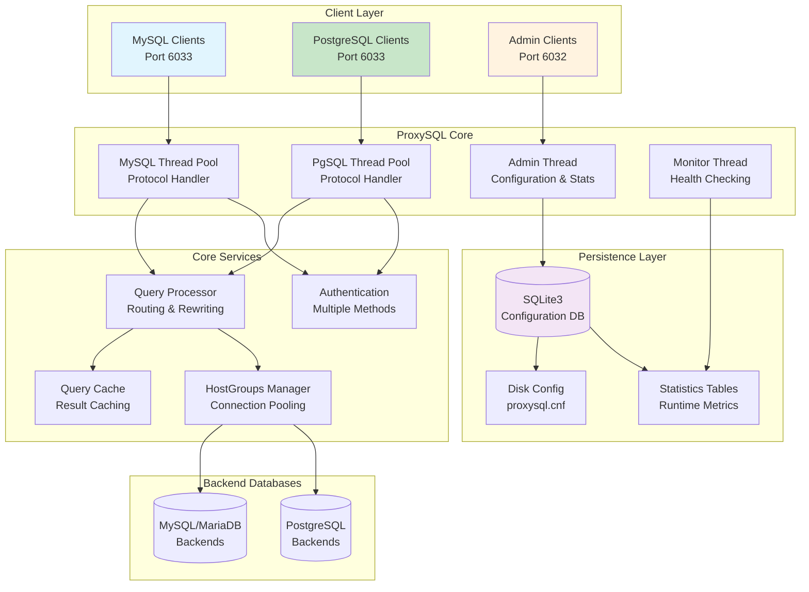
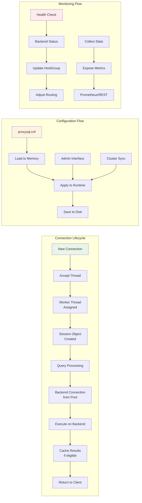
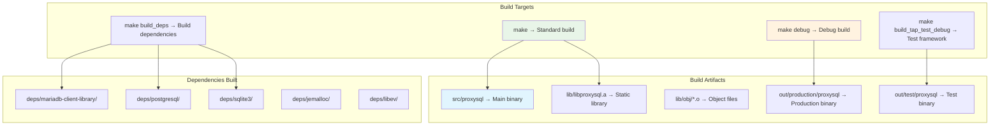
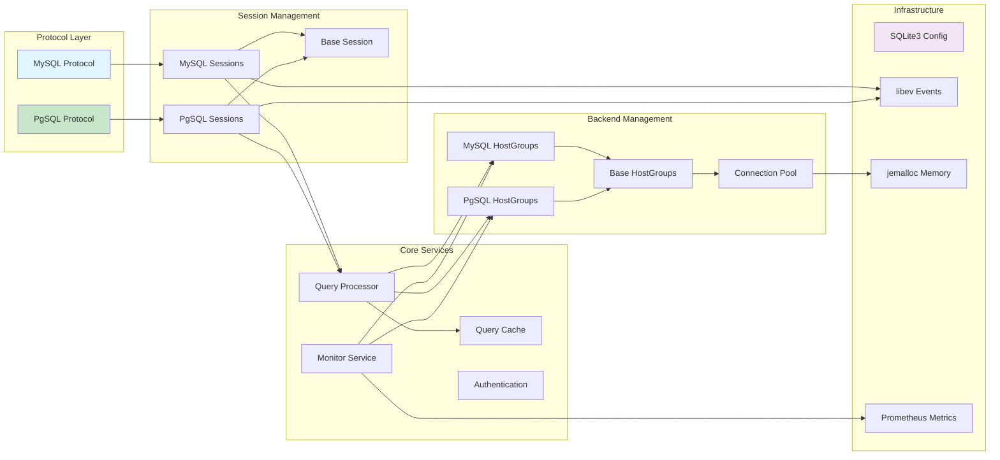
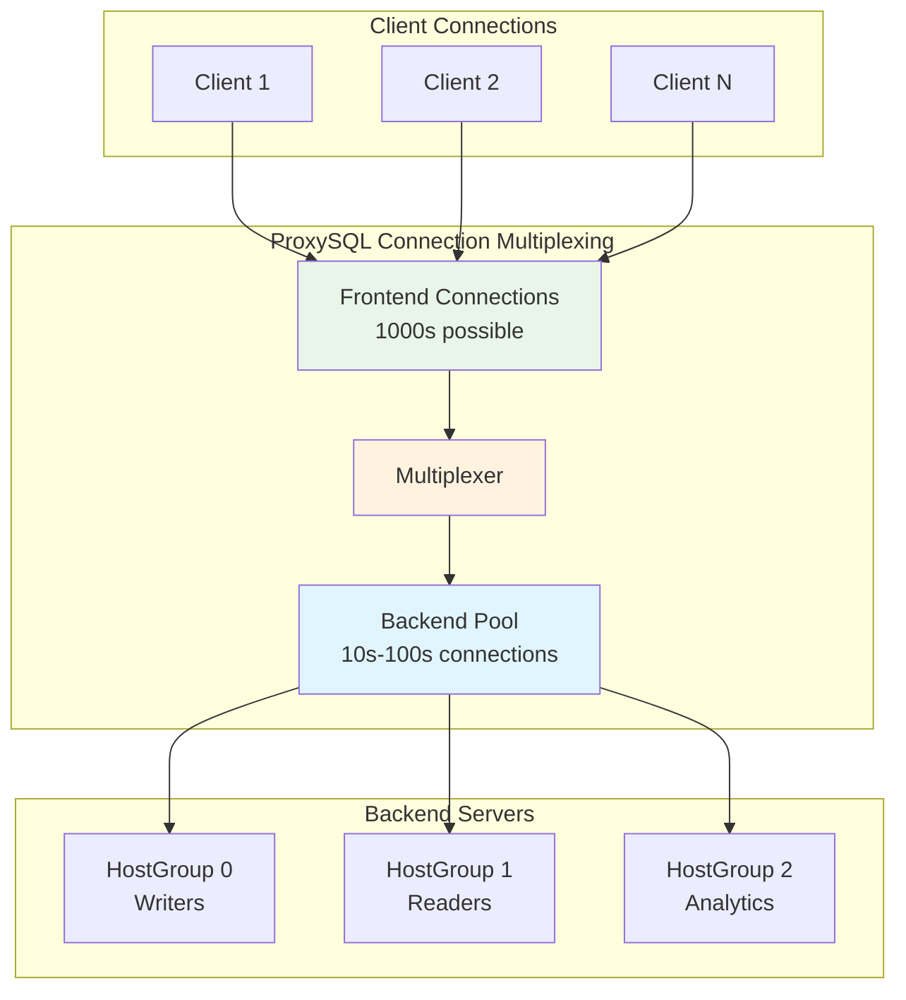

# Project Layout Analysis - ProxySQL

> **⚠️ Important Notice**: This documentation was generated by AI and may contain inaccuracies.
> It should be used as a starting point for exploration only. Always verify critical information
> against the actual source code.
>
> **Last AI Update**: 2025-09-11
> **Status**: NON-VERIFIED
> **Maintainer**: Rene Cannao

## Executive Summary

ProxySQL is a database proxy server written in C++ providing protocol-aware proxying for MySQL and PostgreSQL databases. It implements a multi-threaded, event-driven architecture with connection pooling, query routing, and monitoring. Built with C++11/17, it uses modular design separating protocol handlers, session management, and administrative interfaces, backed by embedded SQLite3 configuration.

## Key Components

- **Dual protocols**: MySQL and PostgreSQL wire protocol implementations
- **Multi-threaded**: Separate worker threads for connections, admin, monitoring, and clustering
- **Configuration**: SQLite3 three-tier system (Disk → Memory → Runtime)
- **Performance features**: Lock-free structures, connection pooling, query caching
- **Enterprise features**: Clustering, monitoring, REST API, and Prometheus metrics

## System Architecture



## Threading Model and Data Flow



## Directory Structure Mapping

### Code Organization
```
https://github.com/sysown/proxysql/tree/v3.0.agentics/
├── src/                        # Main entry points (4 files)
│   ├── main.cpp               # Application entry, thread initialization
│   ├── SQLite3_Server.cpp     # Configuration database
│   ├── proxy_tls.cpp          # TLS/SSL implementation
│   └── proxysql_global.cpp    # Global variables, configuration
│
├── lib/                        # Core library implementations (86 .cpp files)
│   ├── MySQL_*.cpp            # MySQL protocol & management (20+ files)
│   │   ├── MySQL_Protocol.cpp        # Wire protocol
│   │   ├── MySQL_Session.cpp         # Session handling
│   │   ├── MySQL_HostGroups_Manager.cpp # Backend management
│   │   └── MySQL_Monitor.cpp         # Health monitoring
│   │
│   ├── PgSQL_*.cpp            # PostgreSQL protocol & management (15+ files)
│   │   ├── PgSQL_Protocol.cpp        # Wire protocol v3
│   │   ├── PgSQL_Session.cpp         # Session handling
│   │   └── PgSQL_Authentication.cpp  # SASL/SCRAM
│   │
│   ├── ProxySQL_Admin*.cpp    # Administrative interface (10+ files)
│   │   ├── ProxySQL_Admin.cpp        # Admin implementation
│   │   ├── ProxySQL_Admin_Stats.cpp  # Statistics
│   │   └── ProxySQL_RESTAPI_Server.cpp # REST API
│   │
│   ├── Base_*.cpp             # Base infrastructure (5+ files)
│   ├── Query_*.cpp            # Query processing & caching
│   └── libproxysql.a          # Compiled static library (340MB+)
│
├── include/                    # Header files (89 .h files)
│   ├── MySQL_*.h              # MySQL protocol headers
│   ├── PgSQL_*.h              # PostgreSQL protocol headers
│   ├── proxysql_*.h           # Core infrastructure headers
│   └── btree*.h               # Performance data structures
│
├── deps/                       # External dependencies (23 libraries)
│   ├── mariadb-client-library/ # MySQL/MariaDB connector
│   ├── postgresql/             # PostgreSQL client library
│   ├── sqlite3/                # Embedded database
│   ├── libev/                  # Event loop library
│   ├── jemalloc/               # Memory allocator
│   ├── prometheus-cpp/         # Metrics library
│   └── ...                     # 17 more dependencies
│
└── test/                       # Test infrastructure
    ├── tap/tests/              # 220+ TAP tests
    ├── cluster/                # Cluster tests
    └── PrepStmt/               # Prepared statement tests
```

### Build System and Artifacts



## Module Dependencies and Communication



## Configuration and Deployment Architecture

### Three-Tier Configuration System
```
┌─────────────────┐
│   Disk Layer    │  ← proxysql.cnf, persistent storage
├─────────────────┤
│  Memory Layer   │  ← Loaded configuration, staging area
├─────────────────┤
│ Runtime Layer   │  ← Active configuration, live system
└─────────────────┘
```

### Port Mapping
- **6033**: MySQL/PostgreSQL client connections
- **6032**: Admin interface (MySQL protocol)
- **6080**: REST API (HTTP/JSON)
- **6070**: Web UI (optional)

### Docker Deployment Scenarios
```
docker/
├── 1backend/                   # Single backend configuration
├── 5backends-replication/      # Multi-backend with replication
├── images/                     # Container image definitions
│   ├── mysql/                 # MySQL test containers
│   └── proxysql/              # ProxySQL containers
└── scenarios/                  # Testing scenarios
```

## Key Configuration and Operational Patterns

### Runtime Configuration Management
```sql
-- Admin interface SQL commands (port 6032)
INSERT INTO mysql_servers(...) VALUES(...);    -- Add backend
LOAD MYSQL SERVERS TO RUNTIME;                 -- Apply changes
SAVE MYSQL SERVERS TO DISK;                    -- Persist

-- Monitor configuration
UPDATE global_variables SET variable_value=...;
LOAD ADMIN VARIABLES TO RUNTIME;
```

### Query Routing Rules
```sql
-- Define routing rules
INSERT INTO mysql_query_rules (
    rule_id, match_pattern, destination_hostgroup
) VALUES (1, '^SELECT.*FOR UPDATE', 0);       -- Write queries to HG 0
```

### Health Monitoring
- **Health checks**: Configurable intervals
- **Connection verification**: `monitor_ping_interval`
- **Replication lag detection**: Read/write splitting
- **Automatic shunning**: Removes unhealthy backends

## Performance and Scaling Architecture

### Connection Pooling Strategy


### Caching
- **Query Cache**: TTL and pattern-based
- **Prepared Statement Cache**: Metadata caching
- **Connection Attributes Cache**: Reduced authentication overhead

## Testing and Quality Assurance

### Test Infrastructure Layers
1. **Unit Tests**: Component-level testing
2. **TAP Tests**: 220+ Test Anything Protocol tests
3. **Integration Tests**: Full system scenarios
4. **Cluster Tests**: Multi-node configurations
5. **Fuzzing Tests**: AFL-based security testing

### Test Execution
```bash
# Run TAP tests
make build_tap_test_debug
cd test/tap/tests
./run_tests.sh

# Run specific test suite
./test_mysql_connect-t
./test_pgsql_authentication-t
```

## Build and Development Workflow

### Development Setup
```bash
# Clone and build with dependencies
git clone https://github.com/sysown/proxysql.git
cd proxysql
make build_deps
make debug

# Run with custom config
./src/proxysql -f -c proxysql.cnf

# Connect to admin interface
mysql -h127.0.0.1 -P6032 -uadmin -padmin
```

### Debug Build Features
- Full debugging symbols
- Assertion checks enabled
- Memory leak detection
- Core dump generation
- Verbose logging

## Architecture Features

1. **Protocol-Aware**: Understands and manipulates database protocols
2. **Runtime Reconfiguration**: Changes without connection drops
3. **Load Balancing**: Weight-based, least-connections, round-robin
4. **Query Routing**: Regex rules, rewriting, caching
5. **Integration**: Prometheus, REST API, clustering
6. **Security**: SSL/TLS, SQL injection detection, authentication
7. **Performance**: Lock-free statistics, connection pooling, caching
8. **High Availability**: Failover, read/write splitting, lag detection