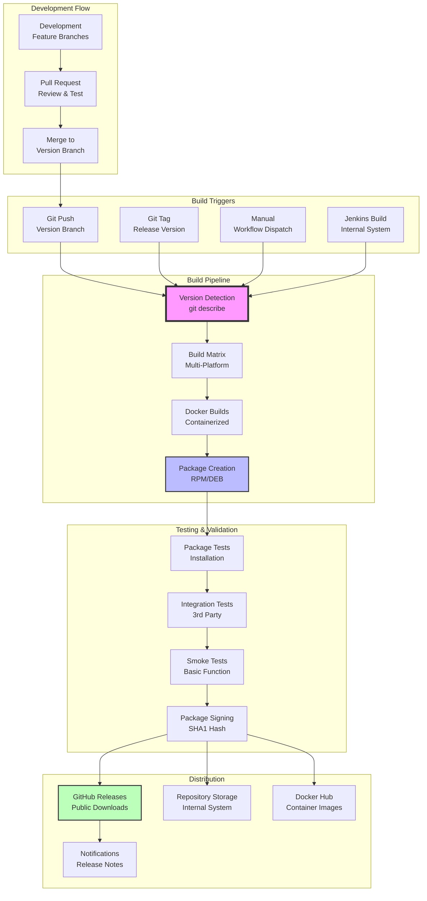
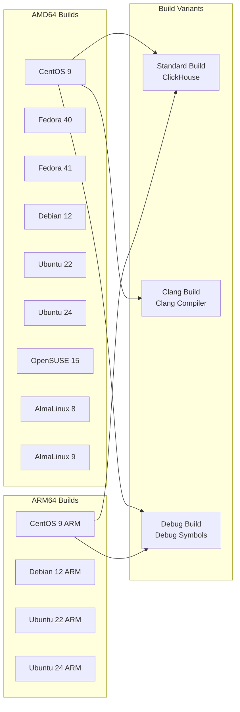
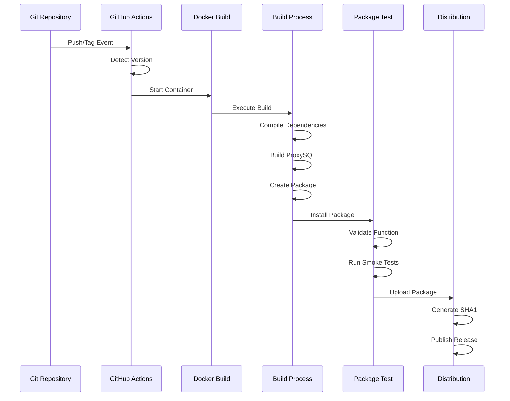
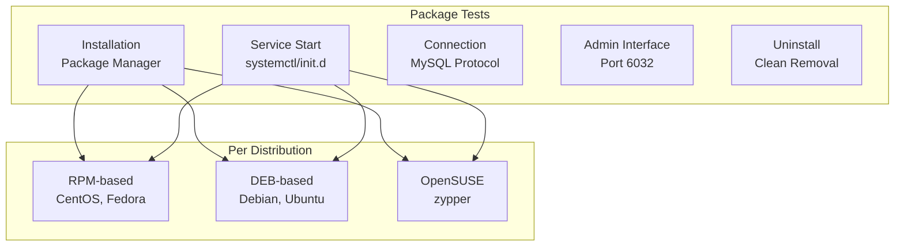
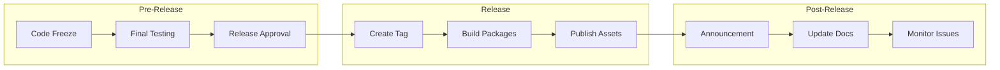
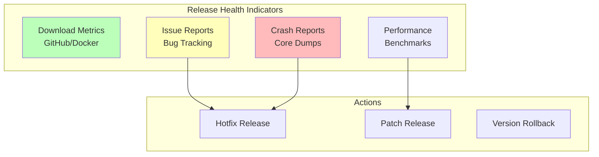

# ProxySQL Release Pipeline Documentation

> **⚠️ Important Notice**: This documentation was generated by AI and may contain inaccuracies.
> It should be used as a starting point for exploration only. Always verify critical information
> against the actual source code.
>
> **Last AI Update**: 2025-09-11
> **Status**: NON-VERIFIED
> **Maintainer**: Rene Cannao

## Executive Summary

ProxySQL employs a sophisticated multi-tier release pipeline that automates package building, testing, and distribution across multiple Linux distributions and architectures. The pipeline integrates GitHub Actions, Jenkins automation *(Internal System)*, Docker-based builds, and comprehensive quality gates to ensure reliable releases for both development snapshots and production versions.

## Release Pipeline Architecture



## Version Management Strategy

### Version Numbering Scheme

**Format**: `MAJOR.MINOR.PATCH-COMMITS-gHASH`

```bash
# Version detection via git describe
GIT_VERSION=$(git describe --long --abbrev=7)
# Example: 2.7.0-404-g6000ede

# Components:
# 2.7.0    - Last tagged version
# 404      - Commits since tag
# g6000ede - Git commit hash (g prefix)
```

### Branch Strategy

| Branch Type | Purpose | Example | Release Type |
|-------------|---------|---------|--------------|
| **Main Development** | Active development | `v3.0` | Development snapshots |
| **Stable** | Production releases | `v2.7` | Official releases |
| **Maintenance** | Bug fixes | `2.x` | Patch releases |
| **Feature** | New features | `feature/pgsql-sasl` | Not released |

### Tagging Convention

```bash
# Production release tags
git tag -a v2.7.0 -m "Release version 2.7.0"
git push origin v2.7.0

# Release candidate tags
git tag -a v2.7.0-rc1 -m "Release candidate 1 for 2.7.0"

# Development snapshot tags (automated)
v3.0-head  # Latest development build
```

## Build Infrastructure

### GitHub Actions Package Build

**Workflow**: `CI-package-build.yml`

```yaml
name: package-build
on:
  workflow_dispatch:
  workflow_run:
    workflows: ["trigger"]
    types: [completed]

jobs:
  get-info:
    outputs:
      is_tag: ${{ steps.tags.outputs.is_tag }}
      is_github_branch: ${{ steps.branches.outputs.is_github_branch }}
      
  amd64-packages:
    strategy:
      matrix:
        dist: [centos9, fedora40, fedora41, debian12, ubuntu22, ubuntu24, 
               opensuse15, almalinux8, almalinux9]
        build: ["", "clang", "dbg"]
```

### Jenkins Build System *(Internal System)*

**Location**: `priv-infra/jenkins-build-scripts/`

**Main Build Scripts**:
```bash
# Package build orchestrator (Internal)
package-build.bash
├── Version detection
├── Docker container setup
├── Multi-architecture builds
├── Package transfer
└── Repository management

# Build script (Internal)
build.bash
├── Dependency compilation
├── ProxySQL compilation
├── Test execution
├── Coverage collection
└── Artifact packaging
```

### Docker Build Environments

**Build Container Matrix**:



**Docker Image Specifications**:
```dockerfile
# Build image example: proxysql/packaging:build-debian12-v3.0
FROM debian:12
RUN apt-get update && apt-get install -y \
    build-essential cmake git \
    libssl-dev libmysqlclient-dev \
    libpq-dev python3 python3-pip
```

## Package Building Process

### Build Execution Flow



### Package Creation Details

**RPM Package Building**:
```bash
# RPM spec generation
Version: ${CURVER}
Release: 1
BuildRoot: %{_tmppath}/%{name}-%{version}-%{release}-root

# Package creation
rpmbuild -bb proxysql.spec
# Output: proxysql-2.7.0-1.x86_64.rpm
```

**DEB Package Building**:
```bash
# Debian control file
Package: proxysql
Version: ${CURVER}-${GIT_VERSION}
Architecture: amd64

# Package creation
dpkg-deb --build proxysql/
# Output: proxysql_2.7.0-1_amd64.deb
```

### Build Optimization

**NOOP Detection**:
```bash
# Skip unchanged builds (Internal)
if [[ "$BUILD_TYPE" == "noop" ]]; then
    echo "No changes detected, skipping build"
    exit 0
fi
```

**Parallel Building**:
```makefile
MAKEFLAGS = -j$(shell nproc)
PARALLEL_JOBS = $(shell nproc)
```

## Quality Gates and Testing

### Package Testing Framework

**Location**: `priv-infra/proxysql-package-tests/` *(Internal System)*

```bash
# Package test execution (Internal)
package-tester.bash
├── Docker environment setup
├── Package installation test
├── Service startup validation
├── Basic functionality check
├── Configuration test
└── Uninstallation verification
```

### Quality Gate Stages

| Stage | Validation | Success Criteria | Failure Action |
|-------|------------|------------------|----------------|
| **Build** | Compilation success | Zero errors | Abort pipeline |
| **Package** | Package creation | Valid RPM/DEB | Abort pipeline |
| **Install** | Installation test | Clean install | Abort pipeline |
| **Startup** | Service startup | ProxySQL running | Abort pipeline |
| **Function** | Basic operations | Query execution | Abort pipeline |
| **Integration** | 3rd party tests | Connector tests pass | Warning only |
| **Performance** | Benchmark tests | No regression | Warning only |

### Testing Matrix



## Artifact Management

### Package Naming Convention

**RPM Packages**:
```
proxysql-{VERSION}-1.{DISTRO}.{ARCH}.rpm
proxysql-2.7.0-1.centos9.x86_64.rpm
proxysql-2.7.0-1.centos9.aarch64.rpm
proxysql-debuginfo-2.7.0-1.centos9.x86_64.rpm
```

**DEB Packages**:
```
proxysql_{VERSION}-{RELEASE}_{ARCH}.deb
proxysql_2.7.0-ubuntu22_amd64.deb
proxysql_2.7.0-ubuntu22_arm64.deb
proxysql-dbg_2.7.0-ubuntu22_amd64.deb
```

### SHA1 Hash Generation

```bash
# Extract binary and generate hash
rpm2cpio package.rpm | cpio -idmv
sha1sum usr/bin/proxysql > package.rpm.id-hash

# For DEB packages
ar x package.deb
tar -xf data.tar.gz
sha1sum usr/bin/proxysql > package.deb.id-hash
```

### Artifact Storage

**GitHub Releases**:
```bash
# Development snapshots
Release: v3.0-head
Assets:
  - proxysql-3.0.0-dev-centos9.x86_64.rpm
  - proxysql_3.0.0-dev-ubuntu22_amd64.deb
  - SHA256SUMS

# Production releases
Release: v2.7.0
Assets:
  - Source code (zip)
  - Source code (tar.gz)
  - All distribution packages
  - Release notes
```

**Repository Storage** *(Internal System)*:
```
/data/repos/ProxySQL-head/
├── binaries-{VERSION}/
│   ├── centos9/
│   ├── debian12/
│   ├── ubuntu22/
│   └── ...
└── archive/
    └── old-versions/
```

## Docker Image Release

### Container Build Pipeline

```dockerfile
# Production Dockerfile
FROM alpine:latest
COPY proxysql /usr/bin/
EXPOSE 6033 6032 6080
ENTRYPOINT ["proxysql", "-f", "-D", "/var/lib/proxysql"]
```

### Docker Hub Publishing

```bash
# Build and tag images
docker build -t proxysql/proxysql:latest .
docker tag proxysql/proxysql:latest proxysql/proxysql:2.7.0
docker tag proxysql/proxysql:latest proxysql/proxysql:2.7

# Multi-architecture manifest
docker manifest create proxysql/proxysql:2.7.0 \
  proxysql/proxysql:2.7.0-amd64 \
  proxysql/proxysql:2.7.0-arm64

# Push to Docker Hub
docker push proxysql/proxysql:2.7.0
docker manifest push proxysql/proxysql:2.7.0
```

## Release Automation

### CI/CD Trigger Configuration

```yaml
# Automatic release on tag
on:
  push:
    tags:
      - 'v*.*.*'
    branches:
      - 'v[0-9].[0-9x]+.?[0-9xy]?[0-9]?'

# Manual release trigger
on:
  workflow_dispatch:
    inputs:
      version:
        description: 'Version to release'
        required: true
      release_type:
        description: 'Release type'
        type: choice
        options:
          - production
          - candidate
          - snapshot
```

### Release Workflow Stages



## Release Notes Generation

### Automated Changelog

```bash
# Generate changelog from commits
git log v2.6.0..v2.7.0 --pretty=format:"* %s (%an)" \
  --grep="^feat\|^fix\|^perf" > CHANGELOG.md

# Categories:
# feat: New features
# fix: Bug fixes
# perf: Performance improvements
# docs: Documentation updates
# test: Test additions
```

### Release Note Template

```markdown
# ProxySQL v2.7.0 Release Notes

## Highlights
- Major feature additions
- Performance improvements
- Security enhancements

## New Features
- Feature 1: Description
- Feature 2: Description

## Bug Fixes
- Fix 1: Issue #XXX - Description
- Fix 2: Issue #YYY - Description

## Breaking Changes
- Change 1: Migration required

## Deprecations
- Deprecated feature 1

## Contributors
- List of contributors

## Downloads
- [CentOS/RHEL packages](link)
- [Debian/Ubuntu packages](link)
- [Docker images](link)
```

## Distribution Channels

### Package Repositories

**RPM Repositories** *(Future Enhancement)*:
```bash
# YUM repository configuration
[proxysql]
name=ProxySQL Repository
baseurl=https://repo.proxysql.com/centos/$releasever/
gpgcheck=1
gpgkey=https://repo.proxysql.com/RPM-GPG-KEY-proxysql
```

**APT Repositories** *(Future Enhancement)*:
```bash
# APT repository configuration
deb https://repo.proxysql.com/debian/ $(lsb_release -cs) main
```

### Direct Downloads

- **GitHub Releases**: Primary distribution channel
- **ProxySQL Website**: Mirror of GitHub releases
- **Docker Hub**: Container images

## Monitoring and Metrics

### Release Metrics

| Metric | Target | Measurement | Tool |
|--------|--------|-------------|------|
| Build Success Rate | >95% | Successful builds/Total | GitHub Actions |
| Package Test Pass Rate | 100% | Passed tests/Total | Jenkins *(Internal)* |
| Release Cycle Time | <2 hours | Tag to publish | CI/CD Pipeline |
| Download Count | Tracked | Downloads per release | GitHub API |
| Issue Report Rate | <5/release | Issues per release | GitHub Issues |

### Release Health Dashboard



## Security Considerations

### Package Signing *(Future Enhancement)*

```bash
# GPG signing for RPM
rpmsign --addsign proxysql-2.7.0-1.x86_64.rpm

# GPG signing for DEB
dpkg-sig --sign builder proxysql_2.7.0-1_amd64.deb

# Checksum generation
sha256sum proxysql-* > SHA256SUMS
gpg --armor --detach-sign SHA256SUMS
```

### Vulnerability Scanning

- **Container scanning**: Trivy, Snyk integration
- **Dependency scanning**: GitHub Dependabot
- **Binary scanning**: Static analysis tools

## Rollback Procedures

### Version Rollback Strategy

```bash
# Package rollback (RPM)
yum downgrade proxysql-2.6.0

# Package rollback (DEB)
apt-get install proxysql=2.6.0

# Docker rollback
docker pull proxysql/proxysql:2.6.0
docker stop proxysql && docker rm proxysql
docker run -d --name proxysql proxysql/proxysql:2.6.0
```

### Emergency Response

1. **Issue Detection**: Monitor crash reports and issues
2. **Impact Assessment**: Evaluate severity and scope
3. **Rollback Decision**: Determine if rollback needed
4. **Communication**: Notify users of issues
5. **Hotfix Release**: Expedited patch release

## Best Practices

### Release Checklist

- [ ] All tests passing in CI/CD
- [ ] Version number updated
- [ ] Changelog updated
- [ ] Documentation updated
- [ ] Release notes prepared
- [ ] Package tests completed
- [ ] Security scan completed
- [ ] Performance benchmarks verified
- [ ] Rollback plan documented
- [ ] Communication plan ready

### Release Cadence

| Release Type | Frequency | Lead Time | Testing Period |
|--------------|-----------|-----------|----------------|
| Major (x.0.0) | 6-12 months | 4 weeks | 2 weeks |
| Minor (x.y.0) | 2-3 months | 2 weeks | 1 week |
| Patch (x.y.z) | As needed | 1 week | 3 days |
| Hotfix | Emergency | Immediate | Minimal |

## Future Enhancements

1. **GPG Signing**: Implement package signing for security
2. **Repository Hosting**: Official APT/YUM repositories
3. **Automated Rollback**: Automatic rollback on critical issues
4. **A/B Testing**: Gradual rollout with metrics
5. **Release Analytics**: Detailed usage and adoption metrics
6. **CD Pipeline**: Continuous deployment for development builds
7. **Multi-Cloud Distribution**: CDN for global distribution

---

*This document represents the current state of ProxySQL's release pipeline. For the latest updates, refer to the GitHub Actions workflows and Jenkins build scripts *(Internal System)* in the repository.*