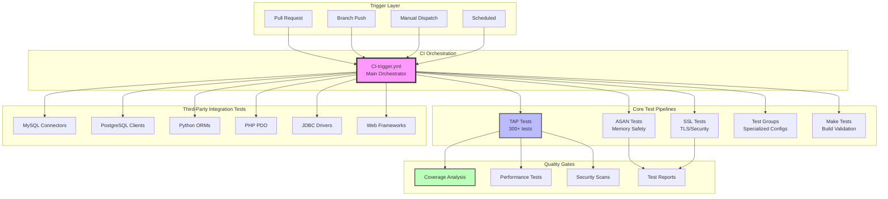
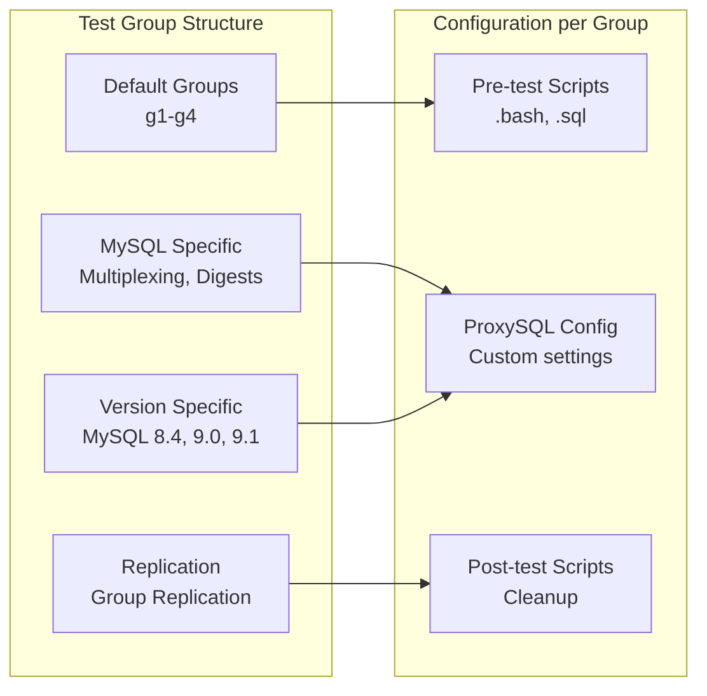
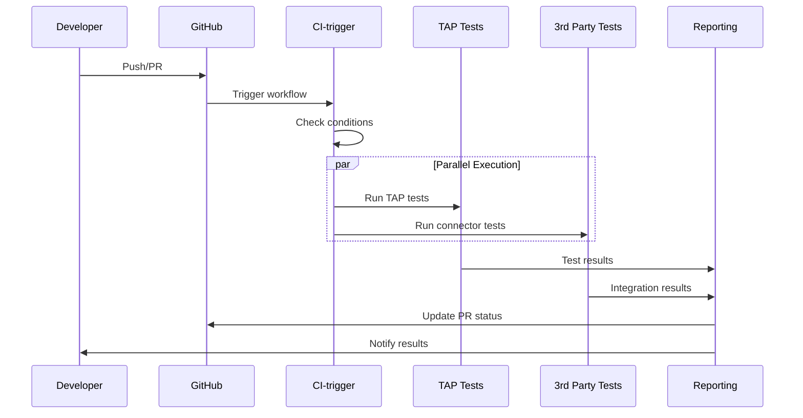
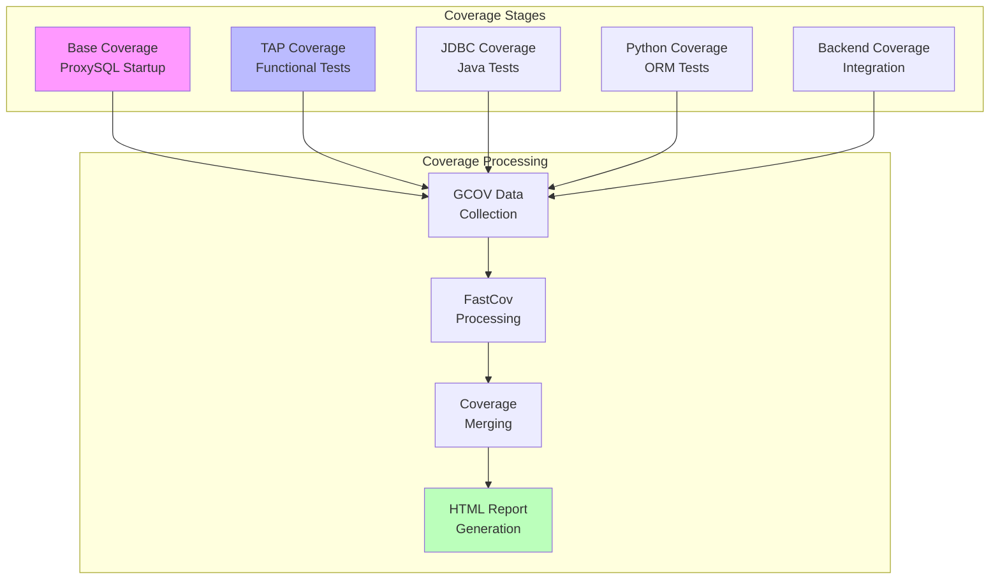
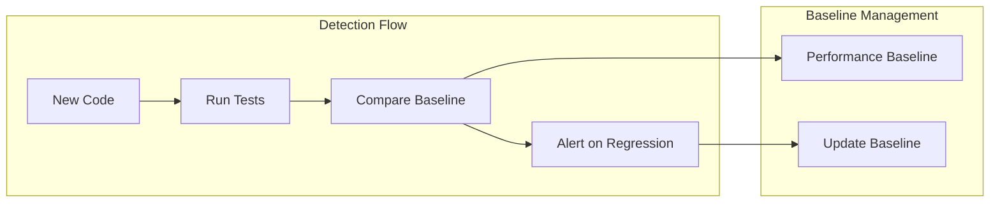
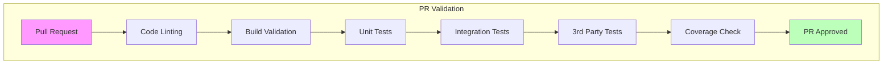

# ProxySQL Test Pipeline Documentation

> **⚠️ Important Notice**: This documentation was generated by AI and may contain inaccuracies.
> It should be used as a starting point for exploration only. Always verify critical information
> against the actual source code.
>
> **Last AI Update**: 2025-09-11
> **Status**: NON-VERIFIED
> **Maintainer**: Rene Cannao

## Executive Summary

ProxySQL implements a comprehensive, multi-layered testing infrastructure that ensures code quality, compatibility, and performance across diverse environments. The test pipeline combines unit testing, integration testing, third-party connector validation, and performance benchmarking through automated CI/CD workflows powered by GitHub Actions and Jenkins automation.

## Test Pipeline Architecture



## Test Categories and Coverage

### 1. Core Functional Testing (TAP Framework)

**Test Anything Protocol (TAP) Tests**
- **Location**: `/test/tap/tests/`
- **Count**: 300+ individual test files
- **Framework**: Custom TAP implementation with C++ bindings

**Test Categories**:

| Category | Description | Test Files | Coverage Area |
|----------|-------------|------------|---------------|
| **Basic Functionality** | Core proxy operations | `basic-t.cpp`, `sqlite3-t.cpp` | Connection handling, SQLite config |
| **MySQL Protocol** | MySQL wire protocol | `mysql-*.cpp` (50+ files) | Protocol parsing, authentication |
| **PostgreSQL Protocol** | PostgreSQL wire protocol | `pgsql-*.cpp` (20+ files) | SASL/SCRAM, protocol handling |
| **Admin Interface** | Management operations | `admin_*.cpp` (15+ files) | Configuration, statistics |
| **Query Processing** | Routing and rewriting | `test_query_*.cpp` | Rules, caching, routing |
| **Prepared Statements** | PS protocol support | `stmt_*.cpp`, `ps_*.cpp` | Binary protocol, metadata |
| **Connection Management** | Pooling and multiplexing | `test_connection_*.cpp` | Pool efficiency, failover |
| **Replication** | Topology awareness | `test_aurora_*.cpp`, `test_galera_*.cpp` | Read/write splitting |
| **Security** | Auth and encryption | `test_ssl_*.cpp`, `test_auth_*.cpp` | TLS, authentication methods |
| **Performance** | Load and stress | `test_ps_large_*.cpp` | Memory usage, throughput |

### 2. Memory Safety Testing (ASAN)

**AddressSanitizer Testing**
- **Workflow**: `CI-taptests-asan.yml`
- **Build Flags**: `NOJEMALLOC=1 WITHASAN=1`
- **Coverage**: Memory leaks, buffer overflows, use-after-free

```bash
# ASAN Build Configuration
make build_tap_tests_debug NOJEMALLOC=1 WITHASAN=1
export ASAN_OPTIONS=abort_on_error=0:halt_on_error=0:print_stats=1
```

### 3. Security Testing (SSL/TLS)

**SSL/TLS Protocol Testing**
- **Workflow**: `CI-taptests-ssl.yml`
- **Test Suite**: Dedicated SSL tests in `test_ssl_*.cpp`
- **Coverage**: Certificate validation, cipher suites, protocol versions

### 4. Test Groups and Configurations

**Specialized Test Groups** (`/test/tap/groups/`)



**Available Test Groups**:
- `default-g1` through `default-g4`: Standard configuration
- `mysql-multiplexing=false-g1-g4`: Multiplexing disabled
- `mysql-query_digests=0-g1-g4`: Query digest disabled
- `mysql84-g1`, `mysql90-g1`, `mysql91-g1`: Version-specific
- `mysql84-gr-g1`, `mysql90-gr-g1`: Group Replication

## Third-Party Integration Testing

### Internal Testing Systems (proxysql_3p_testing)

**⚠️ Note**: Items under `priv-infra/proxysql_3p_testing/` are **Internal Systems**

### Database Connector Testing Matrix

| Connector | Language | Workflow | Internal Test Suite | Test Focus |
|-----------|----------|----------|-------------------|------------|
| **MySQL Connector/J** | Java | `CI-3p-mysql-connector-j.yml` | `test_mysql-connector-j/` *(Internal)* | JDBC compatibility, prepared statements |
| **MariaDB Connector/C** | C | `CI-3p-mariadb-connector-c.yml` | `test_mariadb-connector-c/` *(Internal)* | Native protocol, async operations |
| **PostgreSQL JDBC** | Java | `CI-3p-pgjdbc.yml` | `test_pgjdbc/` *(Internal)* | PgSQL protocol, SASL auth |
| **PHP PDO MySQL** | PHP | `CI-3p-php-pdo-mysql.yml` | `test_php-pdo-mysql/` *(Internal)* | PDO operations, transactions |
| **aiomysql** | Python | `CI-3p-aiomysql.yml` | `test_aiomysql/` *(Internal)* | Async MySQL operations |
| **PostgreSQL libpq** | C | `CI-3p-postgresql.yml` | `test_postgresql/` *(Internal)* | Native PostgreSQL client |

### ORM and Framework Testing

| Framework | Stack | Workflow | Internal Test Suite | Validation |
|-----------|-------|----------|-------------------|------------|
| **SQLAlchemy** | Python ORM | `CI-3p-sqlalchemy.yml` | `test_sqlalchemy/` *(Internal)* | ORM operations, connection pooling |
| **Django** | Python Web | `CI-3p-django-framework.yml` | `test_django-framework/` *(Internal)* | Django ORM, migrations |
| **Laravel** | PHP Web | `CI-3p-laravel-framework.yml` | `test_laravel-framework/` *(Internal)* | Eloquent ORM, migrations |

### Internal Testing Infrastructure Setup

**Location**: `priv-infra/proxysql_3p_testing/` *(Internal System)*

```bash
# Internal setup script
./setup.sh  # Initializes all test submodules

# Common utilities (Internal)
common/
├── mysql_containers.bash    # MySQL container management
├── proxysql_containers.bash # ProxySQL container setup
└── test_utilities.bash      # Shared test functions

# Libraries (Internal)
libs/
├── mysql-connector-j/       # Java MySQL connector
├── mariadb-connector-c/     # MariaDB C library
└── pgjdbc/                  # PostgreSQL JDBC driver
```

## Test Execution Pipeline

### 1. Local Development Testing

```bash
# Build test environment
make build_deps_debug
make debug
make build_tap_test_debug

# Run all TAP tests
cd test/tap/tests
./run_tests.sh

# Run specific test category
./test_mysql_connect-t
./test_pgsql_authentication-t

# Run with custom configuration
TAP_HOST=127.0.0.1 TAP_PORT=6033 ./test_query_cache-t
```

### 2. CI/CD Automated Testing

**GitHub Actions Workflow Execution**



### 3. Test Environment Configuration

**Environment Variables**:
```bash
# Core test configuration
export TAP_HOST=127.0.0.1
export TAP_PORT=6033
export TAP_USERNAME=root
export TAP_PASSWORD=root
export TAP_WORKDIR="$WORKSPACE/test/tap/tests/"

# MySQL backend configuration
export MYSQL_HOST=127.0.0.1
export MYSQL_PORT=3306
export MYSQL_USERNAME=root
export MYSQL_PASSWORD=root

# PostgreSQL backend configuration
export PGSQL_HOST=127.0.0.1
export PGSQL_PORT=5432
export PGSQL_USERNAME=postgres
export PGSQL_PASSWORD=postgres

# Test behavior flags
export SKIP_BIG_TESTS=1        # Skip long-running tests
export EXTENDED_TESTS=0        # Run extended test suite
export WITHASAN=1              # Enable ASAN
export WITHGCOV=1              # Enable coverage
```

## Coverage Analysis Pipeline

### Coverage Collection Infrastructure

**Multi-Stage Coverage Collection**:



**Coverage Build Process**:
```bash
# Build with coverage
make build_src_debug WITHGCOV=1

# Run tests with coverage collection
./test/tap/tests/run_tests.sh

# Generate coverage report
fastcov -b -j$(nproc) --process-gcno -l \
    -e /usr/include/ test/tap/tests \
    -d . -i include lib src \
    -o coverage_report.info

# Generate HTML report with branch coverage
genhtml --branch-coverage coverage_report.info \
    --output-directory coverage_html/
```

### Coverage Metrics and Thresholds

| Component | Target Coverage | Current Coverage | Critical Functions |
|-----------|----------------|------------------|-------------------|
| Core Library (`lib/`) | 80% | Monitored | Protocol handlers, session management |
| Source (`src/`) | 70% | Monitored | Main entry, TLS, SQLite server |
| Admin Interface | 75% | Monitored | Configuration, statistics |
| Query Processor | 85% | Monitored | Routing, caching, rewriting |

## Performance Testing Pipeline

### Load Testing Infrastructure

**Connection Stress Testing**:
```cpp
// test/PrepStmt/client*.cpp - Multiple client scenarios
// Each client simulates different workload patterns
client1.cpp - Simple prepared statement execution
client2.cpp - Bulk insert operations
client3.cpp - Complex transaction patterns
client10.cpp - Maximum connection stress
```

### Benchmark Categories

| Test Type | Location | Metrics | Threshold |
|-----------|----------|---------|-----------|
| **Query Throughput** | `test_query_cache_*` | QPS | No regression |
| **Connection Pool** | `test_connection_*` | Connections/sec | >1000/s |
| **Memory Usage** | `test_*_memory_*` | RSS/VSZ | <2GB base |
| **Latency** | `test_fast_routing_*` | p99 latency | <10ms |
| **Protocol Overhead** | `test_compression_*` | CPU usage | <5% overhead |

## Regression Testing

### Regression Test Suite

**Naming Convention**: `reg_test_*.cpp`

**Categories**:
- **Bug Fixes**: Each fixed bug gets a regression test
- **Protocol Issues**: MySQL/PostgreSQL protocol regressions
- **Performance**: Performance regression detection
- **Security**: Security vulnerability regression tests

### Regression Detection Pipeline



## Security Testing

### Security Test Categories

1. **Authentication Testing**
   - MySQL native authentication
   - MySQL caching_sha2_password
   - PostgreSQL SASL/SCRAM
   - LDAP authentication plugins

2. **SQL Injection Prevention**
   - libinjection integration tests
   - Query firewall validation
   - Pattern matching tests

3. **SSL/TLS Validation**
   - Certificate validation
   - Cipher suite testing
   - Protocol version enforcement

4. **Access Control**
   - User privilege testing
   - Query rules enforcement
   - Connection limits

## Docker-Based Test Environments

### Multi-Platform Testing

```yaml
# docker-compose.yml test configurations
services:
  # CentOS 9 Testing
  centos9_build:
    image: proxysql/packaging:build-centos9
    environment:
      - PROXYSQL_BUILD_TYPE=clickhouse
      - MAKE_FLAGS=-j$(nproc)
  
  # Debian 12 Testing
  debian12_build:
    image: proxysql/packaging:build-debian12
    environment:
      - PROXYSQL_BUILD_TYPE=debug
      - WITHASAN=1
  
  # Ubuntu 24 Testing
  ubuntu24_build:
    image: proxysql/packaging:build-ubuntu24
    environment:
      - PROXYSQL_BUILD_TYPE=clickhouse
      - WITHGCOV=1
```

### Test Scenario Environments

```bash
# Single backend testing
docker/scenarios/1backend/
├── docker-compose.yml
├── mysql/
│   └── init.sql
└── proxysql/
    └── proxysql.cnf

# Replication testing
docker/scenarios/5backends-replication/
├── docker-compose.yml
├── mysql-master/
├── mysql-slave1/
├── mysql-slave2/
└── proxysql/
```

## Continuous Integration Workflow

### PR Validation Pipeline



### Nightly Testing Pipeline

**Extended Test Suite**:
- All test groups execution
- All third-party connectors
- Performance benchmarks
- Memory leak detection
- Security scanning

## Test Reporting and Metrics

### Test Result Aggregation

**TAP Output Processing**:
```bash
# TAP result format
ok 1 - Connection established
ok 2 - Query executed successfully
not ok 3 - Prepared statement failed
# Failed test 3: Expected 1 row, got 0
1..3
```

**GitHub Actions Reporting**:
- Test summaries in PR comments
- Status checks for each test category
- Artifact upload for detailed logs
- Coverage badges and reports

### Quality Metrics Dashboard

| Metric | Target | Current | Trend |
|--------|--------|---------|-------|
| Test Success Rate | >99% | Monitored | ↑ |
| Code Coverage | >75% | Monitored | → |
| Test Execution Time | <30min | Monitored | ↓ |
| Flaky Test Rate | <1% | Monitored | ↓ |

## Best Practices and Guidelines

### Writing New Tests

1. **Use TAP Framework**: All tests should use TAP format
2. **Test Isolation**: Tests must not depend on each other
3. **Resource Cleanup**: Always clean up resources
4. **Timeout Handling**: Set appropriate timeouts
5. **Documentation**: Document test purpose and requirements

### Test Naming Conventions

```cpp
// test_<feature>_<scenario>-t.cpp
test_mysql_connect_basic-t.cpp      // Basic connection test
test_pgsql_auth_scram-t.cpp         // SCRAM authentication test
reg_test_3456_crash_fix-t.cpp       // Regression test for bug #3456
```

### Test Configuration Management

```bash
# Test-specific configuration
cat > test_config.env << EOF
MYSQL_VERSION=8.0
PROXYSQL_CONFIG=test.cnf
ENABLE_DEBUG_OUTPUT=1
EOF

# Load configuration
source test_config.env
./run_tests.sh
```

## Troubleshooting Test Failures

### Common Issues and Solutions

| Issue | Diagnosis | Solution |
|-------|-----------|----------|
| Connection timeout | Check ProxySQL startup | Verify configuration, check logs |
| Test flakiness | Race conditions | Add synchronization, increase timeouts |
| Memory leaks | ASAN reports | Fix leak, update test cleanup |
| Coverage gaps | Low coverage areas | Add targeted tests |

### Debug Information Collection

```bash
# Enable debug output
export PROXYSQL_TEST_DEBUG=1
export TAP_VERBOSE=1

# Collect core dumps
ulimit -c unlimited
export PROXYSQL_COREDUMP_DIR=/tmp/cores/

# Generate detailed logs
./test_failing-t 2>&1 | tee test_debug.log
```

## Future Enhancements

1. **Chaos Testing**: Introduce fault injection testing
2. **Performance Profiling**: Automated performance regression detection
3. **Container Testing**: Kubernetes operator testing
4. **API Testing**: REST API comprehensive testing
5. **Compliance Testing**: GDPR, HIPAA compliance validation

---

*This document represents the current state of ProxySQL's test pipeline. For the latest updates, refer to the GitHub Actions workflows and test documentation in the repository.*