# ProxySQL Visual Architecture Guide

> **⚠️ Important Notice**: This documentation was generated by AI and may contain inaccuracies.
> It should be used as a starting point for exploration only. Always verify critical information
> against the actual source code.
>
> **Last AI Update**: 2025-09-11
> **Status**: NON-VERIFIED
> **Maintainer**: Rene Cannao

## Table of Contents

1. [System Overview](#system-overview)
2. [Code Layout Trees](#code-layout-trees)
3. [Class Hierarchy Diagrams](#class-hierarchy-diagrams)
4. [Database Schema ERD](#database-schema-erd)
5. [Data Flow Architecture](#data-flow-architecture)
6. [Protocol Sequence Diagrams](#protocol-sequence-diagrams)
7. [Thread Architecture](#thread-architecture)
8. [Connection Pooling Architecture](#connection-pooling-architecture)
9. [Query Processing Pipeline](#query-processing-pipeline)
10. [Deployment Topologies](#deployment-topologies)

## System Overview

### High-Level Architecture

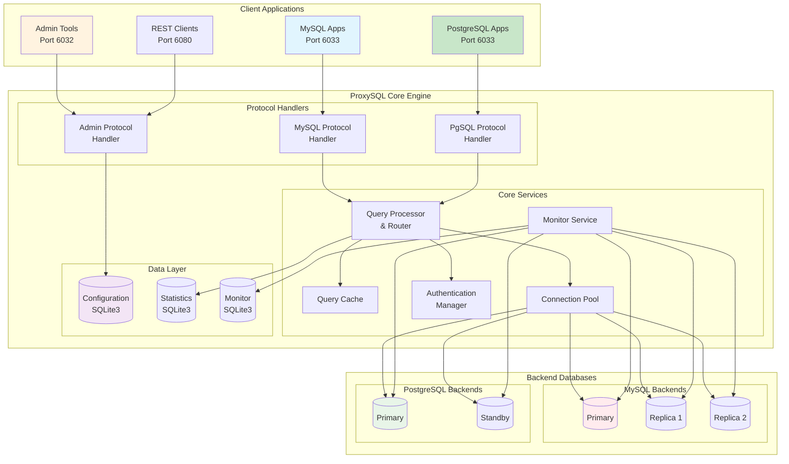

## Code Layout Trees

### Source Code Directory Structure

```
proxysql/
├── src/                                [Main Entry Points - 4 files]
│   ├── main.cpp                       # Application entry, thread init
│   ├── SQLite3_Server.cpp            # Config database server
│   ├── proxy_tls.cpp                 # TLS/SSL implementation
│   └── proxysql_global.cpp           # Global variables, config
│
├── lib/                                [Core Libraries - 86+ files]
│   ├── [MySQL Components - 25+ files]
│   │   ├── MySQL_Session.cpp         # Session management
│   │   ├── MySQL_Protocol.cpp        # Wire protocol
│   │   ├── MySQL_HostGroups_Manager.cpp  # Backend management
│   │   ├── MySQL_Monitor.cpp         # Health monitoring
│   │   ├── MySQL_Authentication.cpp  # Auth methods
│   │   ├── MySQL_Query_Processor.cpp # Query routing
│   │   ├── MySQL_Query_Cache.cpp     # Result caching
│   │   ├── MySQL_Thread.cpp          # Thread pool
│   │   ├── MySQL_Logger.cpp          # Logging
│   │   ├── MySQL_PreparedStatement.cpp # Prepared statements
│   │   └── MySQL_Variables.cpp       # Session variables
│   │
│   ├── [PostgreSQL Components - 20+ files]
│   │   ├── PgSQL_Session.cpp         # Session management
│   │   ├── PgSQL_Protocol.cpp        # Wire protocol v3
│   │   ├── PgSQL_HostGroups_Manager.cpp  # Backend management
│   │   ├── PgSQL_Monitor.cpp         # Health checks
│   │   ├── PgSQL_Authentication.cpp  # SASL/SCRAM
│   │   ├── PgSQL_Query_Processor.cpp # Query routing
│   │   ├── PgSQL_Query_Cache.cpp     # Result caching
│   │   ├── PgSQL_Thread.cpp          # Thread management
│   │   └── PgSQL_Logger.cpp          # Logging
│   │
│   ├── [Base Infrastructure - 10+ files]
│   │   ├── Base_Session.cpp          # Session template base
│   │   ├── Base_Thread.cpp           # Threading base
│   │   ├── Base_HostGroups_Manager.cpp # HostGroups base
│   │   ├── Query_Processor.cpp       # Query processing base
│   │   └── Query_Cache.cpp           # Caching base
│   │
│   ├── [Admin & Monitoring - 15+ files]
│   │   ├── ProxySQL_Admin.cpp        # Admin interface (6032)
│   │   ├── ProxySQL_Admin_Stats.cpp  # Statistics collection
│   │   ├── ProxySQL_RESTAPI_Server.cpp # REST API (6080)
│   │   ├── ProxySQL_HTTP_Server.cpp  # HTTP server
│   │   ├── ProxySQL_Cluster.cpp      # Cluster coordination
│   │   └── ProxySQL_Config.cpp       # Configuration management
│   │
│   └── [Supporting Libraries]
│       ├── Standard_Query_Cache.cpp  # Query cache
│       ├── MySQL_ResultSet.cpp       # Result sets
│       ├── network.cpp               # Network utilities
│       ├── debug.cpp                 # Debug utilities
│       └── libproxysql.a            # Static library (340MB+)
│
├── include/                            [Header Files - 89+ files]
│   ├── [Protocol Headers]
│   │   ├── MySQL_Protocol.h          # MySQL protocol
│   │   ├── PgSQL_Protocol.h          # PostgreSQL protocol
│   │   ├── mysql_connection.h        # MySQL connections
│   │   └── pgsql_connection.h        # PostgreSQL connections
│   │
│   ├── [Core Headers]
│   │   ├── proxysql.h                # Main header
│   │   ├── proxysql_structs.h        # Data structures
│   │   ├── Base_Session.h            # Session base
│   │   ├── Base_Thread.h             # Thread base
│   │   └── Base_HostGroups_Manager.h # HostGroups base
│   │
│   └── [Utility Headers]
│       ├── btree_map.h               # B-tree implementation
│       ├── SpookyV2.h                # Hash functions
│       ├── gen_utils.h               # General utilities
│       └── thread.h                  # Threading utilities
│
├── deps/                               [External Dependencies - 23 libraries]
│   ├── mariadb-client-library/       # MySQL/MariaDB connector
│   ├── postgresql/                   # PostgreSQL client library
│   ├── sqlite3/                      # Embedded database
│   ├── libev/                        # Event loop (epoll/kqueue)
│   ├── jemalloc/                     # Memory allocator
│   ├── prometheus-cpp/               # Metrics library
│   ├── re2/                          # Google RE2 regex
│   ├── libinjection/                 # SQL injection detection
│   ├── clickhouse-cpp/               # ClickHouse support
│   ├── libscram/                     # SCRAM authentication
│   ├── curl/                         # HTTP client
│   └── [12 more libraries...]
│
└── test/                               [Test Infrastructure]
    ├── tap/                           # TAP framework
    │   └── tests/                     # 220+ tests
    │       ├── test_mysql_*.cpp      # MySQL tests
    │       ├── test_pgsql_*.cpp      # PostgreSQL tests
    │       └── test_admin_*.cpp      # Admin tests
    ├── cluster/                       # Cluster tests
    └── PrepStmt/                      # Prepared statements
```

## Class Hierarchy Diagrams

### Template-Based Class Architecture

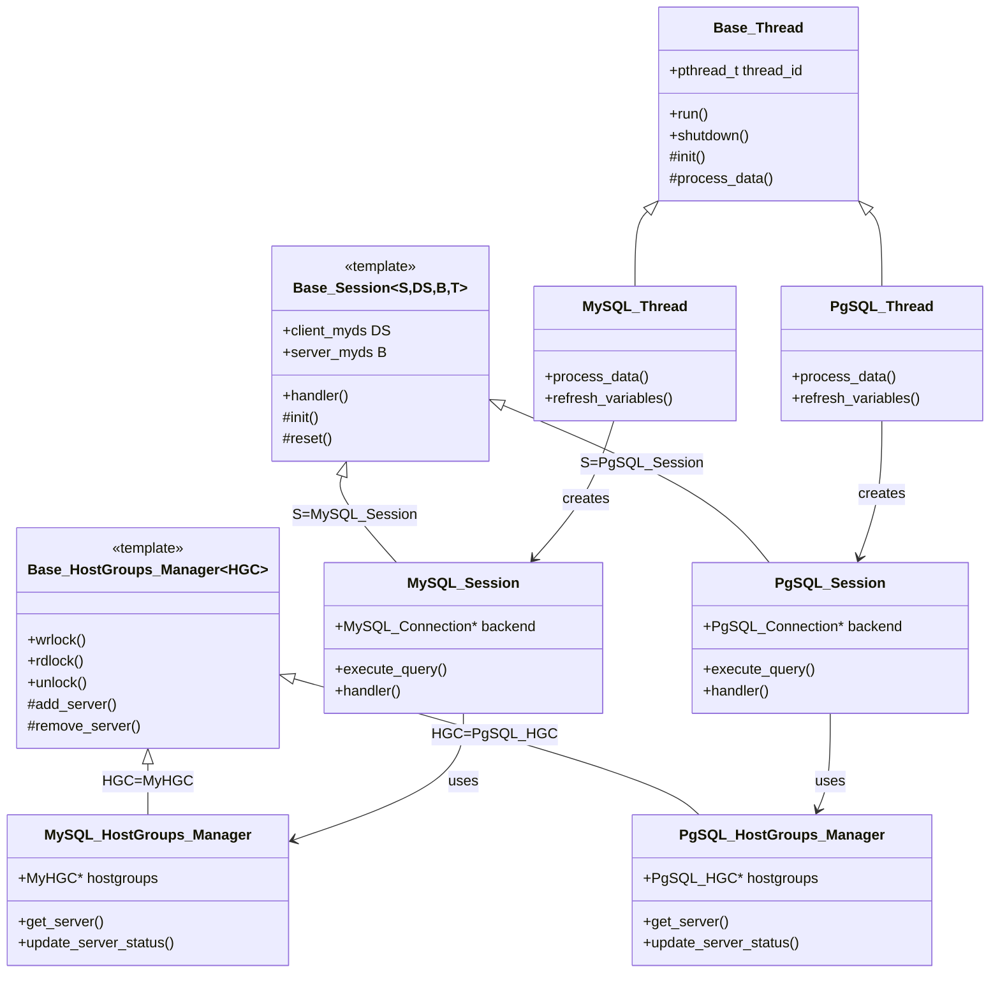

### Query Processing Class Hierarchy

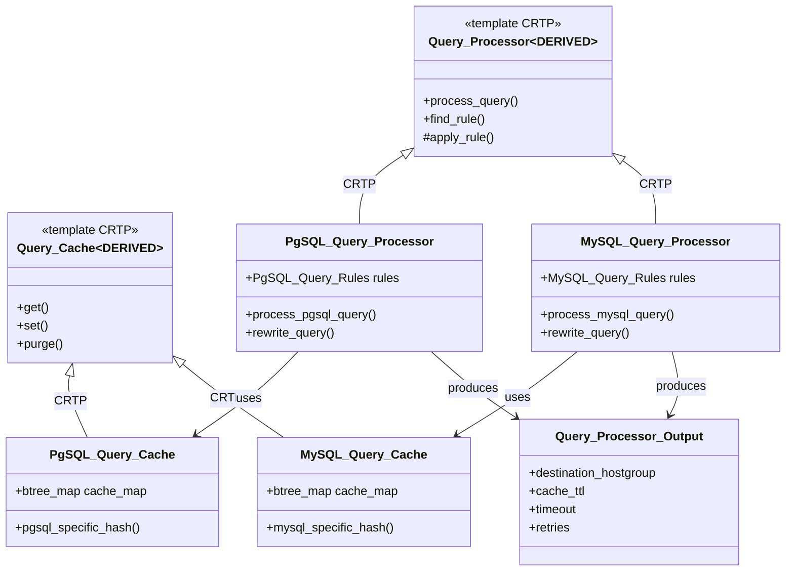

## Database Schema ERD

### Core Configuration Tables

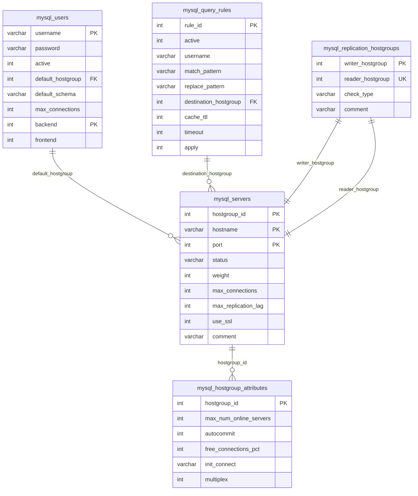

### Statistics and Monitoring Tables

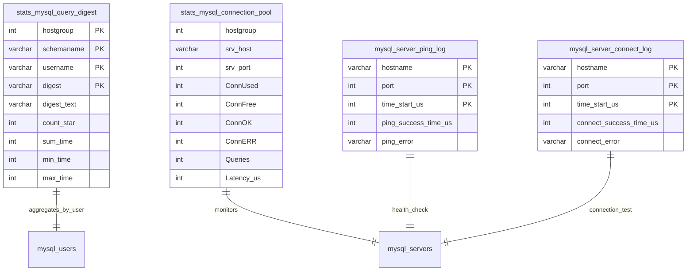

### Configuration to Runtime Flow

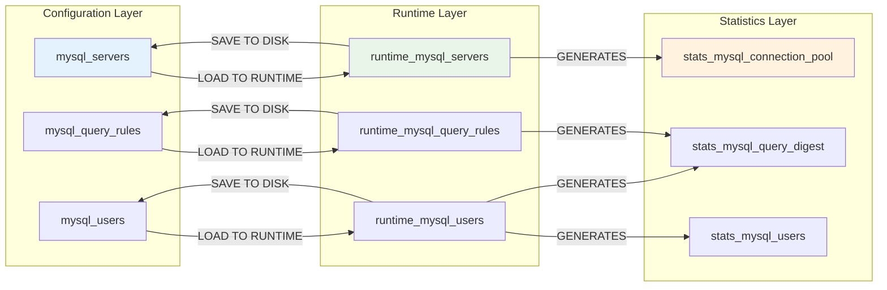

## Data Flow Architecture

### Query Processing Pipeline

```mermaid
graph TB
    subgraph "1. Connection Phase"
        CLIENT[Client Connection] --> ACCEPT[Accept Thread]
        ACCEPT --> ASSIGN[Assign to Worker Thread]
        ASSIGN --> SESSION[Create Session Object]
    end
    
    subgraph "2. Authentication Phase"
        SESSION --> AUTH_CHECK{Auth Required?}
        AUTH_CHECK -->|Yes| AUTH_MOD[Authentication Module]
        AUTH_MOD --> AUTH_CACHE{Cached?}
        AUTH_CACHE -->|No| AUTH_BACKEND[Backend Auth]
        AUTH_CACHE -->|Yes| AUTH_OK[Auth Success]
        AUTH_BACKEND --> AUTH_OK
        AUTH_CHECK -->|No| QUERY_PHASE
    end
    
    subgraph "3. Query Processing Phase"
        AUTH_OK --> QUERY_PHASE[Receive Query]
        QUERY_PHASE --> PARSE[Parse Query]
        PARSE --> DIGEST[Calculate Digest]
        DIGEST --> RULES{Match Rules?}
        RULES -->|Yes| APPLY_RULE[Apply Rule Actions]
        RULES -->|No| DEFAULT_HG[Use Default Hostgroup]
        APPLY_RULE --> REWRITE{Rewrite?}
        REWRITE -->|Yes| MODIFY[Modify Query]
        REWRITE -->|No| CACHE_CHECK
        MODIFY --> CACHE_CHECK
        DEFAULT_HG --> CACHE_CHECK
    end
    
    subgraph "4. Cache Layer"
        CACHE_CHECK{In Cache?}
        CACHE_CHECK -->|Hit| CACHE_RESULT[Return Cached]
        CACHE_CHECK -->|Miss| BACKEND_EXEC
    end
    
    subgraph "5. Backend Execution"
        BACKEND_EXEC[Get Connection] --> POOL{Available?}
        POOL -->|Yes| USE_CONN[Use Pooled]
        POOL -->|No| CREATE_CONN[Create New]
        USE_CONN --> SEND_QUERY[Send to Backend]
        CREATE_CONN --> SEND_QUERY
        SEND_QUERY --> RECEIVE[Receive Result]
        RECEIVE --> CACHE_STORE{Cacheable?}
        CACHE_STORE -->|Yes| STORE[Store in Cache]
        CACHE_STORE -->|No| RETURN
        STORE --> RETURN
    end
    
    subgraph "6. Response Phase"
        CACHE_RESULT --> CLIENT_RESP[Send to Client]
        RETURN[Return Result] --> CLIENT_RESP
        CLIENT_RESP --> STATS[Update Statistics]
        STATS --> NEXT{More Queries?}
        NEXT -->|Yes| QUERY_PHASE
        NEXT -->|No| CLEANUP[Session Cleanup]
    end
    
    style CLIENT fill:#e1f5fe
    style AUTH_OK fill:#c8e6c9
    style CACHE_RESULT fill:#fff3e0
    style RETURN fill:#e8f5e8
```

## Advanced Authentication Flow

### Multi-Stage Authentication State Machine

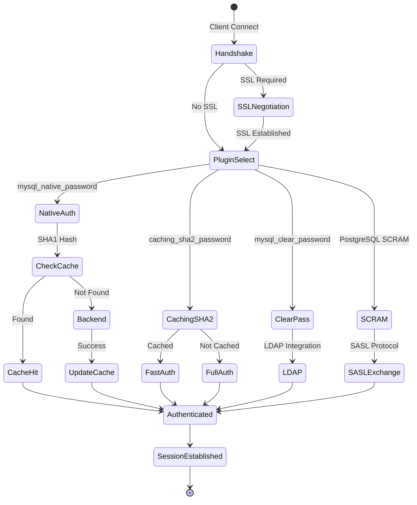

### Query Digest and Rule Processing

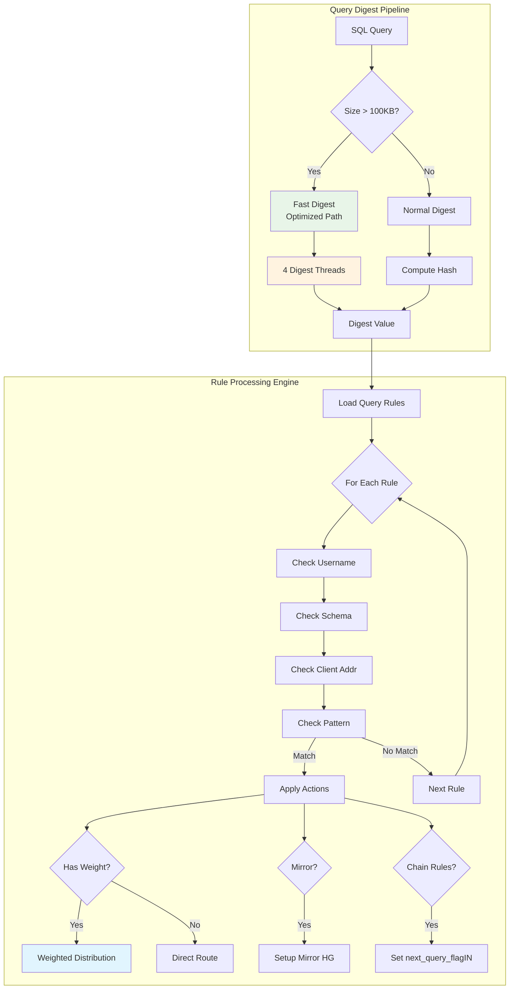

## Protocol Sequence Diagrams

### MySQL Connection and Query Sequence

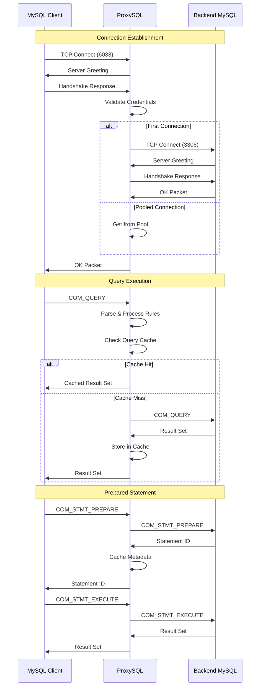

### PostgreSQL Extended Query Protocol

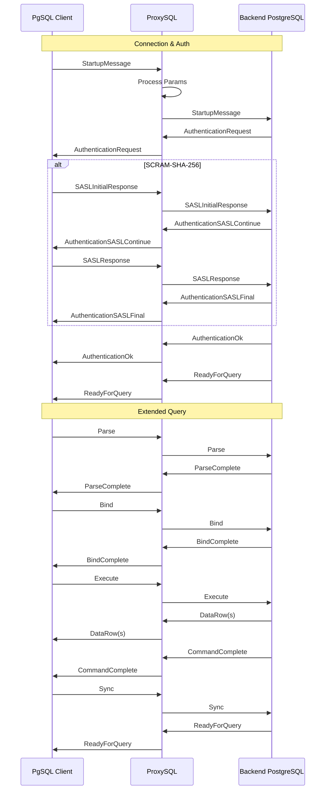

## Thread Architecture

### Thread Processing Model

```mermaid
graph TB
    subgraph "Main Thread"
        MAIN[main()]
        INIT[Initialize]
        CONFIG[Load Config]
        START[Start Threads]
    end
    
    subgraph "Worker Thread Pool"
        subgraph "MySQL Workers [N threads]"
            MW1[MySQL Thread 1]
            MW2[MySQL Thread 2]
            MWN[MySQL Thread N]
        end
        
        subgraph "PgSQL Workers [M threads]"
            PW1[PgSQL Thread 1]
            PW2[PgSQL Thread 2]
            PWM[PgSQL Thread M]
        end
    end
    
    subgraph "Admin Thread"
        ADMIN[Admin Interface<br/>Port 6032]
        REST[REST API<br/>Port 6080]
    end
    
    subgraph "Monitor Threads"
        MMON[MySQL Monitor]
        PMON[PgSQL Monitor]
        PING[Ping Thread]
        READONLY[Read-Only Check]
    end
    
    subgraph "Background Threads"
        STATS[Stats Collector]
        JANITOR[Janitor Thread]
        CLUSTER[Cluster Sync]
    end
    
    MAIN --> INIT
    INIT --> CONFIG
    CONFIG --> START
    
    START --> MW1
    START --> MW2
    START --> MWN
    START --> PW1
    START --> PW2
    START --> PWM
    START --> ADMIN
    START --> MMON
    START --> PMON
    START --> STATS
    START --> JANITOR
    START --> CLUSTER
    
    style MAIN fill:#f3e5f5
    style MW1 fill:#e1f5fe
    style PW1 fill:#c8e6c9
    style ADMIN fill:#fff3e0
```

### Thread Communication

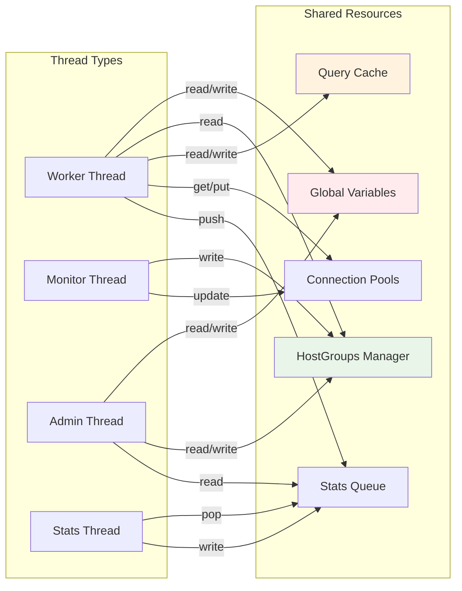

## Connection Pooling Architecture

### Pool Management

```mermaid
graph TB
    subgraph "Connection Pool Internals"
        subgraph "Pool Selection Criteria"
            REQ[Connection Request] --> CRITERIA{Selection Criteria}
            CRITERIA --> LAG[Max Lag Check]
            CRITERIA --> GTID[GTID Position]
            CRITERIA --> LATENCY[Latency Score]
            CRITERIA --> WARM[Connection Warming]
        end
        
        subgraph "Connection States"
            FREE[Free Pool<br/>ConnectionsFree]
            USED[Used Pool<br/>ConnectionsUsed]
            WARMING[Warming Pool<br/>Pre-established]
            EXPIRED[Expired<br/>To be closed]
        end
        
        subgraph "Pool Algorithms"
            ALG1[get_MyConn_from_pool()]
            ALG1 --> CHECK_LAG{Lag < max_lag_ms?}
            CHECK_LAG -->|Yes| CHECK_GTID{GTID Match?}
            CHECK_LAG -->|No| REJECT1[Reject Connection]
            CHECK_GTID -->|Yes| CHECK_LATENCY{Latency OK?}
            CHECK_GTID -->|No| FIND_NEXT[Find Next]
            CHECK_LATENCY -->|Yes| ASSIGN[Assign Connection]
            CHECK_LATENCY -->|No| CREATE_NEW[Create New]
        end
        
        LAG --> FREE
        GTID --> FREE
        LATENCY --> FREE
        WARM --> WARMING
        
        FREE --> USED
        USED --> FREE
        WARMING --> FREE
        FREE --> EXPIRED
        USED --> EXPIRED
    end
    
    style REQ fill:#e1f5fe
    style FREE fill:#e8f5e8
    style USED fill:#ffebee
    style ASSIGN fill:#c8e6c9
```

### Pool Statistics and Metrics

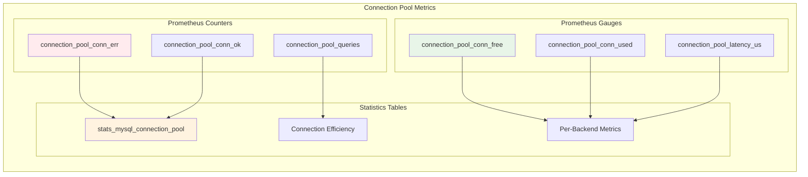

## Connection Pooling Architecture

### Pool Management Strategy

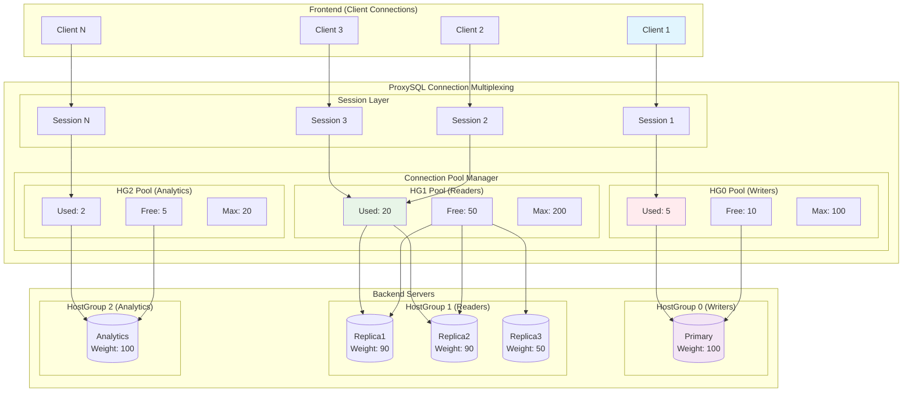

### Connection Lifecycle

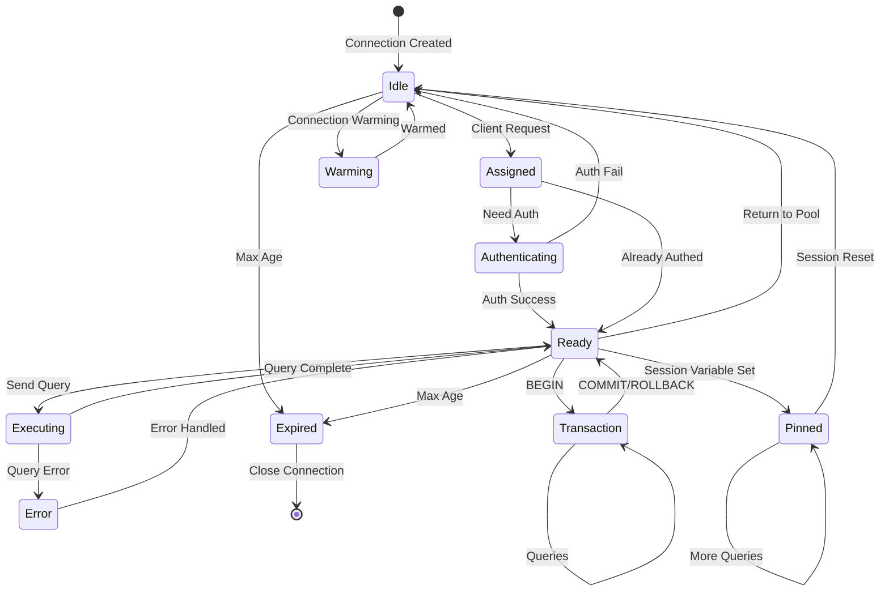

## Query Processing Pipeline

### Rule Evaluation Flow

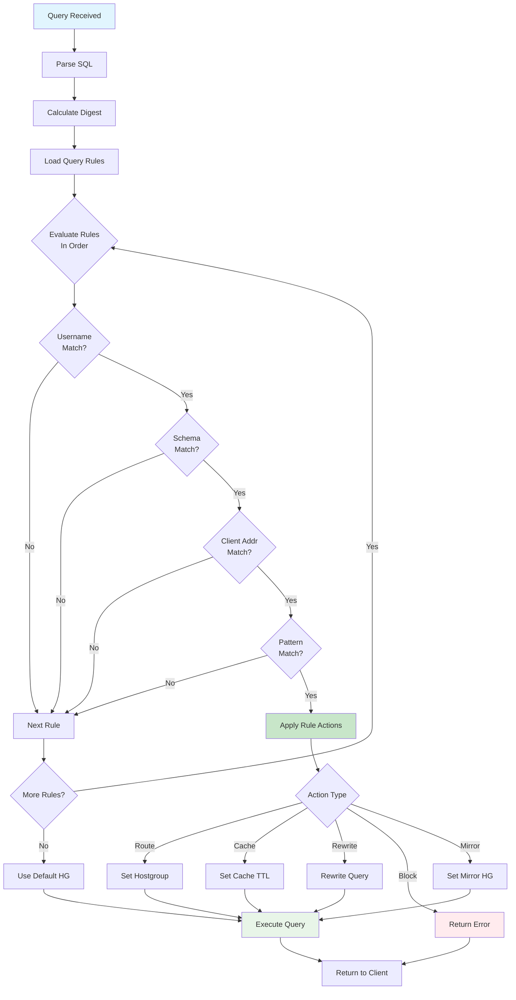

## Deployment Topologies

### Single ProxySQL Instance

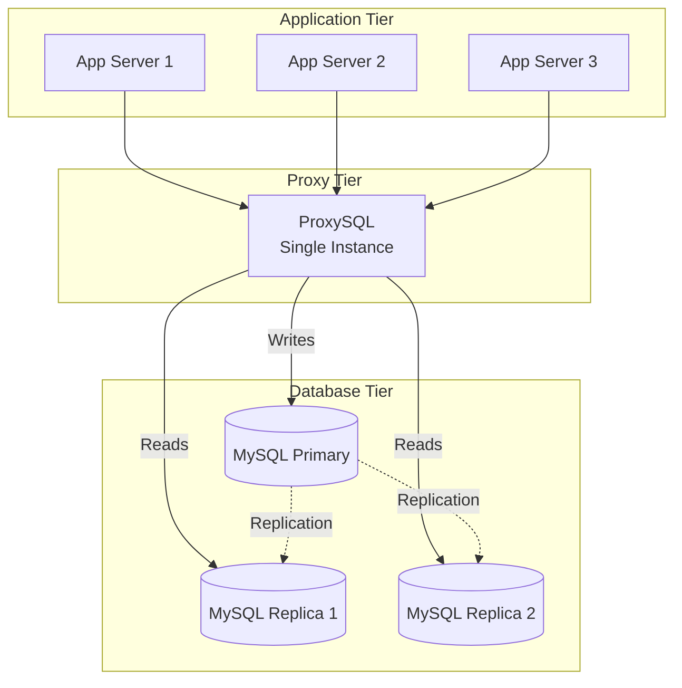

### ProxySQL Cluster (HA)

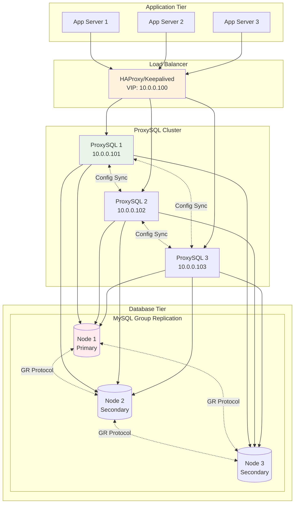

### Multi-Region Deployment

```mermaid
graph TB
    subgraph "Region 1 (Primary)"
        subgraph "Apps R1"
            R1_APP[Applications]
        end
        
        subgraph "ProxySQL R1"
            R1_P1[ProxySQL 1]
            R1_P2[ProxySQL 2]
        end
        
        subgraph "Database R1"
            R1_DB[(Primary DB)]
            R1_R1[(Local Replica)]
        end
    end
    
    subgraph "Region 2 (DR)"
        subgraph "Apps R2"
            R2_APP[Applications]
        end
        
        subgraph "ProxySQL R2"
            R2_P1[ProxySQL 1]
            R2_P2[ProxySQL 2]
        end
        
        subgraph "Database R2"
            R2_DB[(DR Replica)]
            R2_R1[(Local Replica)]
        end
    end
    
    R1_APP --> R1_P1
    R1_APP --> R1_P2
    
    R1_P1 -->|Writes| R1_DB
    R1_P1 -->|Reads| R1_R1
    R1_P2 -->|Writes| R1_DB
    R1_P2 -->|Reads| R1_R1
    
    R2_APP --> R2_P1
    R2_APP --> R2_P2
    
    R2_P1 -->|Reads Only| R2_DB
    R2_P1 -->|Reads| R2_R1
    R2_P2 -->|Reads Only| R2_DB
    R2_P2 -->|Reads| R2_R1
    
    R1_DB -.->|Async Replication| R2_DB
    R1_DB -.->|Sync Replication| R1_R1
    R2_DB -.->|Sync Replication| R2_R1
    
    R1_P1 <-.->|Config Sync| R2_P1
    R1_P2 <-.->|Config Sync| R2_P2
    
    style R1_DB fill:#ffebee
    style R2_DB fill:#e8f5e8
```

### Container Orchestration (Kubernetes)

```mermaid
graph TB
    subgraph "Kubernetes Cluster"
        subgraph "Application Namespace"
            subgraph "App Deployment"
                POD1[App Pod 1]
                POD2[App Pod 2]
                POD3[App Pod 3]
            end
        end
        
        subgraph "ProxySQL Namespace"
            subgraph "ProxySQL StatefulSet"
                PS1[proxysql-0<br/>ConfigMap Mount]
                PS2[proxysql-1<br/>ConfigMap Mount]
                PS3[proxysql-2<br/>ConfigMap Mount]
            end
            
            SVC[ProxySQL Service<br/>ClusterIP]
            CM[ConfigMap<br/>proxysql.cnf]
            SECRET[Secret<br/>Credentials]
        end
        
        subgraph "Database Namespace"
            subgraph "MySQL Operator"
                IDB[InnoDB Cluster<br/>3 Nodes]
            end
        end
    end
    
    POD1 --> SVC
    POD2 --> SVC
    POD3 --> SVC
    
    SVC --> PS1
    SVC --> PS2
    SVC --> PS3
    
    CM --> PS1
    CM --> PS2
    CM --> PS3
    
    SECRET --> PS1
    SECRET --> PS2
    SECRET --> PS3
    
    PS1 --> IDB
    PS2 --> IDB
    PS3 --> IDB
    
    PS1 <-.->|Cluster Sync| PS2
    PS2 <-.->|Cluster Sync| PS3
    PS1 <-.->|Cluster Sync| PS3
    
    style SVC fill:#e1f5fe
    style CM fill:#fff3e0
    style SECRET fill:#ffebee
```

## Monitor Module Architecture

### Work Queue Pattern

```mermaid
graph TB
    subgraph "Monitor Thread Pool"
        subgraph "Work Queue System"
            QUEUE[wqueue<WorkItem>]
            WT1[Worker Thread 1]
            WT2[Worker Thread 2]
            WTN[Worker Thread N]
        end
        
        subgraph "Monitor Tasks"
            CONNECT[Connect Check]
            PING[Ping Check]
            READONLY[Read-Only Check]
            REPLAG[Replication Lag]
            GALERA[Galera Status]
            GROUP_REP[Group Replication]
        end
        
        subgraph "Task Processing"
            CONNECT --> QUEUE
            PING --> QUEUE
            READONLY --> QUEUE
            REPLAG --> QUEUE
            GALERA --> QUEUE
            GROUP_REP --> QUEUE
            
            QUEUE --> WT1
            QUEUE --> WT2
            QUEUE --> WTN
        end
    end
    
    subgraph "Results Processing"
        WT1 --> UPDATE[Update Server Status]
        WT2 --> UPDATE
        WTN --> UPDATE
        
        UPDATE --> SHUN{Shun Server?}
        SHUN -->|Yes| SET_SHUNNED[Mark SHUNNED]
        SHUN -->|No| SET_ONLINE[Keep ONLINE]
    end
    
    style QUEUE fill:#e1f5fe
    style UPDATE fill:#e8f5e8
```

### Health Check State Machine

```mermaid
stateDiagram-v2
    [*] --> ONLINE: Initial State
    
    ONLINE --> CHECKING: Monitor Interval
    
    CHECKING --> CONNECT_TEST: Perform Check
    CONNECT_TEST --> PING_TEST: Connect OK
    CONNECT_TEST --> SHUNNED: Connect Fail
    
    PING_TEST --> LAG_CHECK: Ping OK
    PING_TEST --> SHUNNED: Ping Fail
    
    LAG_CHECK --> ONLINE: Lag < Threshold
    LAG_CHECK --> SHUNNED_LAG: Lag > Threshold
    
    SHUNNED --> RECOVERY: Retry Interval
    SHUNNED_LAG --> RECOVERY: Retry Interval
    
    RECOVERY --> CONNECT_TEST: Retry Check
    
    SHUNNED_LAG --> ONLINE: Lag Resolved
    SHUNNED --> ONLINE: Connection Restored
    
    ONLINE --> OFFLINE_SOFT: Admin Command
    OFFLINE_SOFT --> ONLINE: Admin Command
    
    ONLINE --> OFFLINE_HARD: Admin Command
    OFFLINE_HARD --> [*]: Removed
```

## Cluster Synchronization Architecture

### Checksum-Based Sync Mechanism

```mermaid
graph TB
    subgraph "Node A"
        A_CONFIG[Configuration]
        A_CHECKSUM[Calculate Checksum]
        A_EPOCH[Epoch: 100]
        A_VERSION[Version: 2]
        
        A_CONFIG --> A_CHECKSUM
        A_CHECKSUM --> A_CS[Checksum: 0xABCD]
    end
    
    subgraph "Node B"
        B_CONFIG[Configuration]
        B_CHECKSUM[Calculate Checksum]
        B_EPOCH[Epoch: 101]
        B_VERSION[Version: 2]
        
        B_CONFIG --> B_CHECKSUM
        B_CHECKSUM --> B_CS[Checksum: 0xEF01]
    end
    
    subgraph "Sync Decision"
        COMPARE{Compare Checksums}
        A_CS --> COMPARE
        B_CS --> COMPARE
        
        COMPARE -->|Different| CHECK_EPOCH{Check Epoch}
        COMPARE -->|Same| NO_SYNC[No Sync Needed]
        
        CHECK_EPOCH -->|B > A| SYNC_FROM_B[A syncs from B]
        CHECK_EPOCH -->|A > B| SYNC_FROM_A[B syncs from A]
        
        SYNC_FROM_B --> APPLY_B[Apply B's Config to A]
        SYNC_FROM_A --> APPLY_A[Apply A's Config to B]
    end
    
    style A_EPOCH fill:#e1f5fe
    style B_EPOCH fill:#e8f5e8
    style SYNC_FROM_B fill:#fff3e0
```

### Cluster Module Synchronization

```mermaid
graph LR
    subgraph "Configuration Modules"
        M1[mysql_servers]
        M2[mysql_users]
        M3[mysql_query_rules]
        M4[mysql_variables]
        M5[proxysql_servers]
    end
    
    subgraph "Checksum Calculation"
        M1 --> CS1[Checksum 1]
        M2 --> CS2[Checksum 2]
        M3 --> CS3[Checksum 3]
        M4 --> CS4[Checksum 4]
        M5 --> CS5[Checksum 5]
    end
    
    subgraph "Sync Decision per Module"
        CS1 --> DIFF1{Diff Count}
        CS2 --> DIFF2{Diff Count}
        CS3 --> DIFF3{Diff Count}
        
        DIFF1 -->|>= threshold| SYNC1[Sync Module 1]
        DIFF2 -->|>= threshold| SYNC2[Sync Module 2]
        DIFF3 -->|>= threshold| SYNC3[Sync Module 3]
    end
    
    subgraph "Global Checksum"
        CS1 --> GLOBAL[Global Checksum]
        CS2 --> GLOBAL
        CS3 --> GLOBAL
        CS4 --> GLOBAL
        CS5 --> GLOBAL
    end
    
    style M1 fill:#e1f5fe
    style GLOBAL fill:#fff3e0
```

## Galera Cluster Monitoring

### WSREP Variable Monitoring Flow

```mermaid
graph TB
    subgraph "Galera Health Check Pipeline"
        START[Monitor Timer Trigger] --> CHECK_INTERVAL{Interval Elapsed?}
        CHECK_INTERVAL -->|Yes| FETCH_WSREP[Fetch WSREP Variables]
        CHECK_INTERVAL -->|No| WAIT[Wait]
        
        FETCH_WSREP --> PARSE[Parse WSREP Status]
        
        subgraph "WSREP Variables Check"
            PARSE --> V1[wsrep_ready]
            PARSE --> V2[wsrep_cluster_status]
            PARSE --> V3[wsrep_local_state]
            PARSE --> V4[wsrep_desync]
            PARSE --> V5[wsrep_reject_queries]
            PARSE --> V6[wsrep_sst_donor_rejects_queries]
        end
        
        V1 --> EVAL{Evaluate Health}
        V2 --> EVAL
        V3 --> EVAL
        V4 --> EVAL
        V5 --> EVAL
        V6 --> EVAL
        
        EVAL --> DECISION{Healthy?}
        DECISION -->|Yes| MARK_ONLINE[Mark Server ONLINE]
        DECISION -->|No| CHECK_TIMEOUT{Timeout Count}
        
        CHECK_TIMEOUT -->|< Max| INCREMENT[Increment Counter]
        CHECK_TIMEOUT -->|>= Max| MARK_OFFLINE[Mark Server OFFLINE]
        
        INCREMENT --> LOG_WARNING[Log Warning]
        MARK_ONLINE --> UPDATE_HG[Update Hostgroup]
        MARK_OFFLINE --> UPDATE_HG
        LOG_WARNING --> UPDATE_HG
    end
    
    style START fill:#e1f5fe
    style FETCH_WSREP fill:#fff3e0
    style MARK_ONLINE fill:#c8e6c9
    style MARK_OFFLINE fill:#ffebee
```

### Galera Node State Transitions

```mermaid
stateDiagram-v2
    [*] --> Disconnected: Initial
    
    Disconnected --> Connecting: Join Cluster
    Connecting --> Joining: SST/IST
    
    Joining --> Synced: State Transfer Complete
    Synced --> Donor: Become Donor
    Donor --> Synced: Donation Complete
    
    Synced --> Desync: Manual Desync
    Desync --> Synced: Resync
    
    state "wsrep_local_state" {
        1_Joining: 1 - Joining
        2_Donor: 2 - Donor/Desynced
        3_Joined: 3 - Joined
        4_Synced: 4 - Synced
    }
    
    state "wsrep_cluster_status" {
        Primary: Primary Component
        NonPrimary: Non-Primary
        Disconnected_State: Disconnected
    }
    
    Synced --> Primary: Normal Operation
    Primary --> NonPrimary: Network Partition
    NonPrimary --> Primary: Partition Healed
    
    Synced --> Error: wsrep_reject_queries=ON
    Error --> Synced: Recovery
    
    note right of Donor
        During SST donation:
        - wsrep_sst_donor_rejects_queries
        - Affects availability
    end note
```

## Bootstrap Mode Implementation

### Group Replication Bootstrap Flow

```mermaid
graph TB
    subgraph "Bootstrap Initialization"
        DETECT[Detect Bootstrap Mode] --> CHECK_VAR{bootstrap_variables?}
        CHECK_VAR -->|Present| PARSE_JSON[Parse JSON Config]
        CHECK_VAR -->|Absent| NORMAL_START[Normal Startup]
        
        PARSE_JSON --> EXTRACT[Extract Parameters]
        EXTRACT --> VAL_HG[writer_hostgroup]
        EXTRACT --> VAL_RD[reader_hostgroup]
        EXTRACT --> VAL_WR[writer_is_also_reader]
        EXTRACT --> VAL_MX[max_writers]
    end
    
    subgraph "Auto-Discovery Phase"
        VAL_MX --> QUERY_NODES[Query All Nodes]
        QUERY_NODES --> CHECK_PRIMARY{Find Primary?}
        
        CHECK_PRIMARY -->|Found| GET_MEMBERS[Get Member List]
        CHECK_PRIMARY -->|Not Found| RETRY{Retry Count?}
        RETRY -->|< Max| WAIT_RETRY[Wait & Retry]
        RETRY -->|>= Max| FAIL[Bootstrap Failed]
        
        WAIT_RETRY --> QUERY_NODES
        
        GET_MEMBERS --> BUILD_CONFIG[Build Configuration]
    end
    
    subgraph "Configuration Generation"
        BUILD_CONFIG --> GEN_SERVERS[Generate mysql_servers]
        BUILD_CONFIG --> GEN_GROUPS[Generate mysql_group_replication_hostgroups]
        
        GEN_SERVERS --> POPULATE_WR[Populate Writer HG]
        GEN_SERVERS --> POPULATE_RD[Populate Reader HG]
        
        subgraph "Server Assignment"
            POPULATE_WR --> PRIMARY_NODE[Primary → Writer HG]
            POPULATE_RD --> SECONDARY_NODES[Secondaries → Reader HG]
            
            VAL_WR -->|writer_is_also_reader=1| PRIMARY_BOTH[Primary → Both HGs]
        end
    end
    
    subgraph "Activation"
        PRIMARY_NODE --> LOAD_RUNTIME[Load to Runtime]
        SECONDARY_NODES --> LOAD_RUNTIME
        PRIMARY_BOTH --> LOAD_RUNTIME
        
        LOAD_RUNTIME --> SAVE_DISK[Save to Disk]
        SAVE_DISK --> MONITOR_START[Start Monitoring]
        MONITOR_START --> COMPLETE[Bootstrap Complete]
    end
    
    style DETECT fill:#e1f5fe
    style CHECK_PRIMARY fill:#fff3e0
    style COMPLETE fill:#c8e6c9
    style FAIL fill:#ffebee
```

### Bootstrap Variables Processing

```mermaid
graph LR
    subgraph "JSON Bootstrap Config"
        JSON[bootstrap_variables JSON] --> PARSE{Parse JSON}
        
        PARSE --> P1[writer_hostgroup: 10]
        PARSE --> P2[reader_hostgroup: 11]
        PARSE --> P3[backup_writer_hostgroup: 12]
        PARSE --> P4[offline_hostgroup: 9999]
        PARSE --> P5[max_writers: 1]
        PARSE --> P6[writer_is_also_reader: 2]
        PARSE --> P7[max_transactions_behind: 0]
        
        subgraph "writer_is_also_reader modes"
            P6 --> M0[0: Writer not in reader HG]
            P6 --> M1[1: Writer also in reader HG]
            P6 --> M2[2: Writer in backup_writer + reader HG]
        end
    end
    
    style JSON fill:#e1f5fe
    style M2 fill:#c8e6c9
```

## Query Digest Generation Pipeline

### SpookyV2 Hash Calculation

```mermaid
graph TB
    subgraph "Query Normalization Pipeline"
        QUERY[Original Query] --> SIZE_CHECK{Size > 100KB?}
        
        SIZE_CHECK -->|Yes| LARGE_QUERY[Large Query Path]
        SIZE_CHECK -->|No| NORMAL_PATH[Normal Path]
        
        subgraph "Tokenization Process"
            NORMAL_PATH --> TOKENIZE[Tokenize SQL]
            TOKENIZE --> REPLACE_LITERALS[Replace Literals with ?]
            REPLACE_LITERALS --> NORMALIZE_WS[Normalize Whitespace]
            NORMALIZE_WS --> CASE_NORM[Lowercase Keywords]
        end
        
        subgraph "Large Query Optimization"
            LARGE_QUERY --> THREAD_POOL[4 Digest Threads]
            THREAD_POOL --> CHUNK[Process in Chunks]
            CHUNK --> PARALLEL_HASH[Parallel SpookyV2]
        end
        
        CASE_NORM --> HASH_INPUT[Normalized Query Text]
        PARALLEL_HASH --> HASH_INPUT
    end
    
    subgraph "SpookyV2 Hashing"
        HASH_INPUT --> SPOOKY_INIT[SpookyHash::Init()]
        SPOOKY_INIT --> SPOOKY_UPDATE[SpookyHash::Update(data, len)]
        SPOOKY_UPDATE --> SPOOKY_FINAL[SpookyHash::Final(&hash1, &hash2)]
        SPOOKY_FINAL --> DIGEST[64-bit Digest Value]
    end
    
    subgraph "Digest Storage"
        DIGEST --> STATS_TABLE[stats_mysql_query_digest]
        DIGEST --> QUERY_CACHE_KEY[Cache Key]
        DIGEST --> RULE_MATCHING[Rule Digest Match]
    end
    
    style QUERY fill:#e1f5fe
    style THREAD_POOL fill:#fff3e0
    style DIGEST fill:#c8e6c9
```

### Query Normalization Known Issues

```mermaid
graph TB
    subgraph "Known Query Digest Bugs"
        BUG1[Bug: INSERT normalization<br/>INSERT INTO t VALUES (1),(2)]
        BUG2[Bug: IN clause ordering<br/>WHERE id IN (3,1,2)]
        BUG3[Bug: Float normalization<br/>1.5 vs 1.50]
        BUG4[Bug: String escape<br/>'O\'Brien' vs 'O''Brien']
        BUG5[Bug: Comment stripping<br/>/* comment */ variations]
        BUG6[Bug: Whitespace handling<br/>Tab vs Space]
        BUG7[Bug: Case sensitivity<br/>SELECT vs select in strings]
        BUG8[Bug: Numeric formats<br/>0x1A vs 26]
        BUG9[Bug: NULL handling<br/>IS NULL variations]
        BUG10[Bug: Operator spacing<br/>a=1 vs a = 1]
        BUG11[Bug: Subquery formatting]
        BUG12[Bug: JOIN reordering]
    end
    
    subgraph "Impact on Caching"
        BUG1 --> CACHE_MISS[Cache Misses]
        BUG2 --> CACHE_MISS
        BUG3 --> CACHE_MISS
        BUG4 --> CACHE_MISS
        
        CACHE_MISS --> PERF_IMPACT[Performance Impact]
        CACHE_MISS --> STATS_SKEW[Statistics Skew]
    end
    
    style BUG1 fill:#ffebee
    style CACHE_MISS fill:#fff3e0
```

## SSL/TLS Implementation

### Non-Standard mTLS Flow

```mermaid
sequenceDiagram
    participant C as Client
    participant P as ProxySQL
    participant B as Backend MySQL
    
    Note over C,P: Frontend SSL (Standard)
    C->>P: TCP Connect
    P->>C: MySQL Greeting (SSL Capable)
    C->>P: SSL Request
    P->>C: SSL Handshake
    C->>P: Client Certificate
    P->>P: Verify Client Cert
    P->>C: SSL Established
    
    Note over C,P: Authentication Phase
    C->>P: MySQL Handshake
    P->>P: Extract Username
    
    Note over P,B: Backend SSL (Non-Standard)
    P->>B: TCP Connect
    B->>P: MySQL Greeting
    P->>B: SSL Request
    B->>P: SSL Handshake Start
    
    rect rgb(255, 230, 230)
        Note over P,B: Non-Standard Behavior
        P->>B: Client Certificate
        B->>P: SSL Established
        B->>P: Request MySQL Auth
        P->>B: MySQL Handshake
        P->>P: Post-Handshake Validation
        P->>P: Match Frontend Username
        P->>P: Verify Cert CN/SAN
    end
    
    alt Validation Success
        P->>B: Complete Auth
        B->>P: OK Packet
    else Validation Failure
        P->>P: Close Backend
        P->>C: Error Response
    end
```

### SPIFFE Certificate Flow

```mermaid
graph TB
    subgraph "SPIFFE Authentication"
        CLIENT[Client with SPIFFE Cert] --> EXTRACT_URI[Extract SPIFFE URI]
        EXTRACT_URI --> PARSE_URI[Parse spiffe://domain/path]
        
        PARSE_URI --> VALIDATE{Validate Format}
        VALIDATE -->|Valid| CHECK_MAPPING[Check URI Mapping]
        VALIDATE -->|Invalid| REJECT[Reject Connection]
        
        CHECK_MAPPING --> MAP_TABLE[SPIFFE → Username Map]
        MAP_TABLE --> FOUND{Mapping Found?}
        
        FOUND -->|Yes| SET_USER[Set MySQL Username]
        FOUND -->|No| DEFAULT_USER[Use Default/Reject]
        
        SET_USER --> AUTH_BACKEND[Authenticate to Backend]
        DEFAULT_USER --> AUTH_BACKEND
    end
    
    subgraph "Certificate Validation"
        AUTH_BACKEND --> VERIFY_CHAIN[Verify Cert Chain]
        VERIFY_CHAIN --> CHECK_EXPIRY[Check Expiration]
        CHECK_EXPIRY --> CHECK_REVOKE[Check Revocation]
        CHECK_REVOKE --> VALIDATED[Certificate Valid]
    end
    
    style CLIENT fill:#e1f5fe
    style VALIDATED fill:#c8e6c9
    style REJECT fill:#ffebee
```

## Cluster Synchronization Details

### Differential Sync Algorithm

```mermaid
graph TB
    subgraph "Checksum Calculation Per Module"
        subgraph "Module: mysql_servers"
            S_QUERY[SELECT * FROM mysql_servers] --> S_HASH[SpookyV2 Hash]
            S_HASH --> S_CHECK[Checksum: 0xABCD1234]
        end
        
        subgraph "Module: mysql_users"
            U_QUERY[SELECT * FROM mysql_users] --> U_HASH[SpookyV2 Hash]
            U_HASH --> U_CHECK[Checksum: 0xDEAD5678]
        end
        
        subgraph "Module: mysql_query_rules"
            Q_QUERY[SELECT * FROM mysql_query_rules] --> Q_HASH[SpookyV2 Hash]
            Q_HASH --> Q_CHECK[Checksum: 0xBEEF9012]
        end
    end
    
    subgraph "Sync Decision Logic"
        S_CHECK --> COMPARE_S{Compare with Peers}
        U_CHECK --> COMPARE_U{Compare with Peers}
        Q_CHECK --> COMPARE_Q{Compare with Peers}
        
        COMPARE_S -->|Different| S_DIFF[Calculate Diff Count]
        COMPARE_U -->|Different| U_DIFF[Calculate Diff Count]
        COMPARE_Q -->|Different| Q_DIFF[Calculate Diff Count]
        
        S_DIFF --> S_THRESH{Diff > mysql_servers_diffs_before_sync?}
        U_DIFF --> U_THRESH{Diff > mysql_users_diffs_before_sync?}
        Q_DIFF --> Q_THRESH{Diff > mysql_query_rules_diffs_before_sync?}
        
        S_THRESH -->|Yes| S_SYNC[Sync mysql_servers]
        U_THRESH -->|Yes| U_SYNC[Sync mysql_users]
        Q_THRESH -->|Yes| Q_SYNC[Sync mysql_query_rules]
    end
    
    subgraph "Sync Execution"
        S_SYNC --> FETCH_S[Fetch from Peer with Higher Epoch]
        U_SYNC --> FETCH_U[Fetch from Peer with Higher Epoch]
        Q_SYNC --> FETCH_Q[Fetch from Peer with Higher Epoch]
        
        FETCH_S --> APPLY_S[Apply to Runtime]
        FETCH_U --> APPLY_U[Apply to Runtime]
        FETCH_Q --> APPLY_Q[Apply to Runtime]
        
        APPLY_S --> PERSIST[Save to Disk]
        APPLY_U --> PERSIST
        APPLY_Q --> PERSIST
    end
    
    style S_CHECK fill:#e1f5fe
    style U_CHECK fill:#e8f5e8
    style Q_CHECK fill:#fff3e0
    style PERSIST fill:#c8e6c9
```

### Cluster Node Communication

```mermaid
sequenceDiagram
    participant N1 as Node 1 (Leader)
    participant N2 as Node 2
    participant N3 as Node 3
    
    Note over N1,N3: Periodic Sync Check (5s default)
    
    N1->>N2: Request Checksums
    N1->>N3: Request Checksums
    
    N2->>N1: Response {epoch:100, checksums:[...]}
    N3->>N1: Response {epoch:99, checksums:[...]}
    
    N1->>N1: Compare Checksums
    
    alt Checksums Differ
        N1->>N1: Check Diff Counts
        
        alt Diff > Threshold
            N1->>N2: Request Full Data
            N2->>N1: Send mysql_servers rows
            N1->>N1: Apply Changes
            
            N1->>N3: Push Updates
            N3->>N3: Apply Changes
        else Diff < Threshold
            N1->>N1: Increment Counter
            N1->>N1: Wait Next Cycle
        end
    else Checksums Match
        N1->>N1: No Action Needed
    end
    
    Note over N1,N3: Update Global Checksum
    N1->>N2: Broadcast Global Checksum
    N1->>N3: Broadcast Global Checksum
```

## Read-Only Server Management

### Evolution of Read-Only Handling

```mermaid
graph TB
    subgraph "Legacy Mode (Pre-2.5.1)"
        L_CHECK[Check read_only] --> L_BINARY{Binary Decision}
        L_BINARY -->|read_only=0| L_WRITER[Assign to Writer HG]
        L_BINARY -->|read_only=1| L_READER[Assign to Reader HG]
    end
    
    subgraph "Modern Mode (2.5.1+)"
        M_CHECK[Check Multiple Variables] --> M_EVAL[Weighted Evaluation]
        
        subgraph "Variables Checked"
            V1[read_only: weight 100]
            V2[innodb_read_only: weight 1000]
            V3[super_read_only: weight 10000]
            V4[innodb_super_read_only: custom]
            V5[aws_aurora_info: custom]
        end
        
        V1 --> M_EVAL
        V2 --> M_EVAL
        V3 --> M_EVAL
        V4 --> M_EVAL
        V5 --> M_EVAL
        
        M_EVAL --> SCORE[Calculate Total Score]
        SCORE --> DECISION{Score Evaluation}
        
        DECISION -->|Score = 0| ASSIGN_WRITER[To Writer HG]
        DECISION -->|Score > 0| ASSIGN_READER[To Reader HG]
        DECISION -->|Aurora Writer| FORCE_WRITER[Override: Writer]
    end
    
    subgraph "Aurora Special Handling"
        V5 --> AURORA_CHECK{Is Aurora?}
        AURORA_CHECK -->|Yes| PARSE_JSON[Parse JSON Info]
        PARSE_JSON --> CHECK_ROLE{Check Role}
        CHECK_ROLE -->|WRITER| FORCE_WRITER
        CHECK_ROLE -->|READER| ASSIGN_READER
    end
    
    style L_BINARY fill:#ffebee
    style M_EVAL fill:#e8f5e8
    style AURORA_CHECK fill:#e1f5fe
```

## Performance Optimization Points

### Performance Optimizations

```mermaid
graph LR
    subgraph "Performance Critical Components"
        subgraph "Lock-Free Structures"
            LF1[Statistics Counters]
            LF2[Query Digest Map]
            LF3[Connection Pool Stats]
        end
        
        subgraph "Caching Layers"
            C1[Query Result Cache]
            C2[Authentication Cache]
            C3[Prepared Statement Cache]
            C4[DNS Cache]
        end
        
        subgraph "Connection Pooling"
            CP1[Connection Reuse]
            CP2[Multiplexing]
            CP3[Persistent Connections]
        end
        
        subgraph "Memory Management"
            MM1[jemalloc Allocator]
            MM2[Memory Pools]
            MM3[Buffer Reuse]
        end
    end
    
    style LF1 fill:#e8f5e8
    style C1 fill:#e1f5fe
    style CP1 fill:#fff3e0
    style MM1 fill:#ffebee
```

